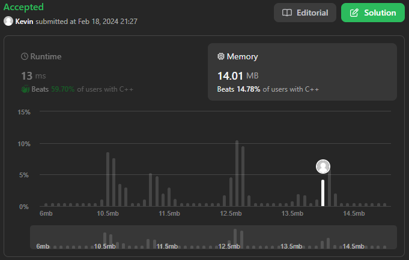

# 1. Two Sum

## Énoncé

Étant donné un tableau de nombres entiers et une cible entière, renvoie les indices des deux nombres tels que la somme est égale à la cible.

Vous pouvez supposer que chaque entrée aurait exactement une solution et vous ne pouvez pas utiliser deux fois le même élément.

Vous pouvez renvoyer la réponse dans n'importe quel ordre.

Pouvez-vous proposer un algorithme dont la complexité temporelle est inférieure à O(n^2) ?

## Exemple

**Example 1:**  
**Input:** nums = [2,7,11,15], target = 9  
**Output:** [0,1]  
**Explication:** Parce que nums[0] + nums[1] == 9, nous renvoyons [0, 1].

**Example 2:**  
**Input:** nums = [3,2,4], target = 6  
**Output:** [1,2]

**Example 3:**  
**Input:** nums = [3,3], target = 6  
**Output:** [0,1]

## Contraintes

`2 <= nums.length <= 10^4`  
`-10^9 <= nums[i] <= 10^9`  
`-10^9 <= target <= 10^9`

Une seule réponse valide existe.

## Note personnelle

Malgré sa simplicité globale, cet exercice s'avère intéressant en raison du défi supplémentaire posé par la demande de maintenir une complexité inférieure à O(n^2).

