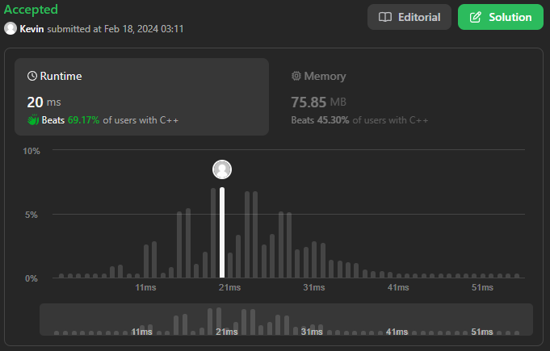

# 2. Add Two Numbers

## Énoncé

Vous recevez deux listes chaînées non vides représentant deux entiers non négatifs. Les chiffres sont stockés dans l'ordre inverse et chacun de leurs nœuds contient un seul chiffre. Ajoutez les deux nombres et renvoyez la somme sous forme de liste chaînée.

Vous pouvez supposer que les deux nombres ne contiennent aucun zéro non significatif, à l’exception du nombre 0 lui-même.

## Exemple

**Example 1:**  
**Input:** l1 = [2,4,3], l2 = [5,6,4]  
**Output:** [7,0,8]  
**Explication:** 342 + 465 = 807.

**Example 2:**  
**Input:** l1 = [0], l2 = [0]  
**Output:** [0]

**Example 3:**  
**Input:** l1 = [9,9,9,9,9,9,9], l2 = [9,9,9,9]  
**Output:** [8,9,9,9,0,0,0,1]

## Contraintes

Le nombre de noeuds dans chaque liste chaînée est compris dans la plage `[1, 100]`.  
`0 <= Node.val <= 9`  
Il est garanti que la liste représente un nombre sans zéros non significatifs.

## Note personnelle

J'ai commis une erreur dans l'interprétation de l'énoncé, qui mentionnait "You are given two non-empty linked lists representing two non-negative integers".

Cette interprétation m'a conduit à supposer que je pouvais extraire directement les nombres stockés dans les listes, ce qui m'a fait perdre du temps.

Par la suite, j'ai pris connaissance des contraintes, dont une spécifie que "The number of nodes in each linked list is in the range [1, 100]".

Étant donné qu'aucun type natif en C++ ne permet de stocker un nombre de 100 chiffres sans perte de précision, j'ai dû recommencer de zéro.

Conclusion : Lire les contraintes est important.

