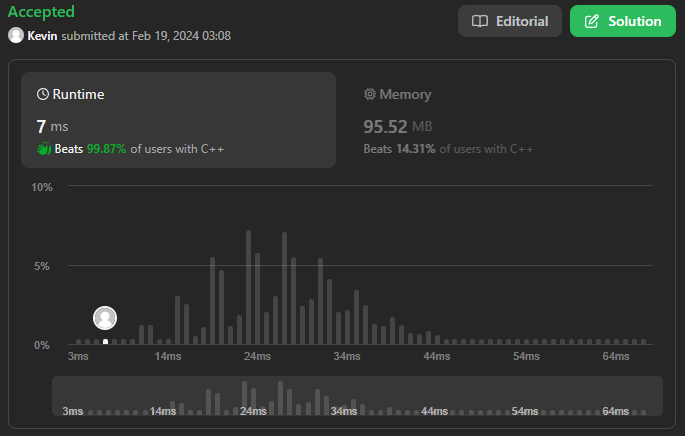

# 4. Median of Two Sorted Arrays

## Énoncé

Étant donné deux tableaux triés `nums1` et `nums2` de taille `m` et `n` respectivement, renvoie la médiane des deux tableaux triés.

La complexité globale du temps d'exécution doit être `O(log (m+n))`.

## Exemple

**Example 1:**  
**Input:** nums1 = [1,3], nums2 = [2]  
**Output:** 2.00000  
**Explication:** tableau fusionné = [1,2,3] et la médiane est 2.

**Example 2:**  
**Input:** nums1 = [1,2], nums2 = [3,4]  
**Output:** 2.50000  
**Explication:** tableau fusionné = [1,2,3,4] et la médiane est (2 + 3) / 2 = 2.5.

## Contraintes

`nums1.length == m`  
`nums2.length == n`  
`0 <= m <= 1000`  
`0 <= n <= 1000`  
`1 <= m + n <= 2000`  
`-106 <= nums1[i], nums2[i] <= 106`

## Note personnelle

Cet exercice s'est avéré très difficile, et malheureusement, je n'ai pas réussi à respecter la contrainte de créer un algorithme avec une complexité de O(log(m+n)).  
Cela me laisse un sentiment d'échec, malgré tous mes efforts déployés.

De plus, je crois que le rapport présenté ci-dessous est biaisé par les jeux de tests utilisés.  
La plupart doivent sûrement utiliser des tableaux de petite taille, ce qui peut fausser le temps d'exécution affiché.  
Je suppose que le temps d'exécution rapporté est la moyenne de tous les tests effectués.

