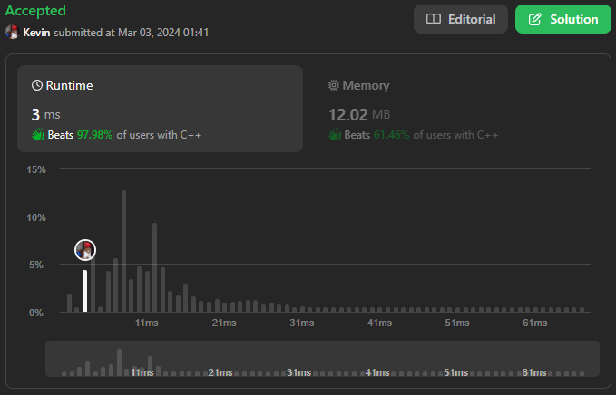
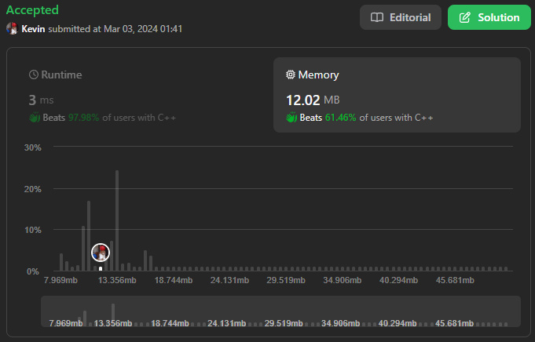

# 6. Zigzag Conversion

## Énoncé

La chaîne `"PAYPALISHIRING"` est écrite en zigzag sur un nombre donné de lignes comme ceci

```
P   A   H   N
 A P L S I I G
  Y   I   R
```

Et puis lisez ligne par ligne : `"PAHNAPLSIIGYIR"`

Écrivez le code qui prendra une chaîne et effectuez cette conversion étant donné un nombre de lignes

## Exemple

**Exemple 1:**  
**Input:** s = "PAYPALISHIRING", numRows = 3  
**Output:** "PAHNAPLSIIGYIR"

**Exemple 2:**  
**Input:** s = "PAYPALISHIRING", numRows = 4  
**Output:** "PINALSIGYAHRPI"  
**Explication:**

```
P     I     N
 A   L S   I G
  Y A   H R
   P     I
```

**Exemple 3:**  
**Input:** s = "A", numRows = 1  
**Output:** "A"

## Contraintes

`1 <= s.length <= 1000`  
`s` se compose de lettres anglaises (minuscules et majuscules), `','` et `'.'`.  
`1 <= numRows <= 1000`

## Note personnelle

Pour résoudre ce problème, j'ai mis en place une méthode reposant sur l'utilisation d'un vecteur de chaînes de caractères pour stocker les sous-chaînes de chaque ligne du texte.

J'ai également utilisé deux valeurs pour suivre la ligne actuelle ainsi que pour déterminer si l'indice de ligne doit être incrémenté ou décrémenté.

Complexité temporelle: `O(n)`  
Complexité spatiale: `O(n)`



