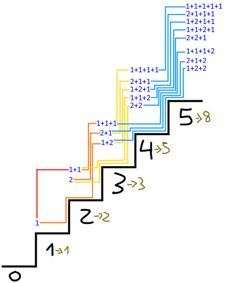

# 70. Climbing Stairs

## Énoncé

Vous montez un escalier. Il y a `n` marches pour atteindre le sommet.

À chaque fois, vous pouvez monter de `1` ou `2` marches. De combien de manières distinctes pouvez-vous grimper jusqu’au sommet ?

## Exemple

**Exemple 1:**  
**Input:** n = 2  
**Output:** 2  
**Explication:** Il existe deux façons de grimper au sommet.

- 1 + 1
- 2

**Exemple 2:**  
**Input:** n = 3  
**Output:** 3  
**Explication:** Il existe trois façons de grimper au sommet.

- 1 + 1 + 1
- 1 + 2
- 2 + 1

## Contraintes

`1 <= n <= 45`

## Note personnelle

Pour aborder ce problème, j'ai commencé par modéliser les étapes nécessaires sur un nombre limité de marches afin de voir si je pouvais déduire quelque chose de celles-ci.

Les premières étapes sont données par l'exemple, en calculant les étapes suivantes, on remarque rapidement qu'on utilise au maximum les résultats de l'étape `n - 2` pour calculer l'étape `n`.

Voici un schéma représentant les combinaisons possibles pour un escalier de 5 marches.



[1, 2, 3, 5, 8] Cela me fait penser à une suite assez connue en mathématiques, la **suite de Fibonacci**.

Partant du principe qu'il s'agit de la suite de Fibonacci, j'ai opté pour une approche récursive utilisant le principe de la mémorisation pour éviter les calculs redondants.

```cpp
// Utilisation d'une unordered_map pour stocker les résultats déjà calculés
std::unordered_map<int, int> cache;

// Fonction récursive pour calculer le nombre de façons de monter n escaliers
int climbStairs(int n) {
  // Cas de base : quand il ne reste qu'un ou deux escaliers à monter,
  // le nombre de façons de monter est directement n
  if (n == 1 || n == 2) {
    return n;
  }
  // Vérifie si le résultat pour n a déjà été calculé
  if (cache.find(n) == cache.end()) {
    // Si non, calcule le résultat récursivement en combinant
    // le nombre de façons de monter n-1 et n-2 escaliers
    cache[n] = climbStairs(n - 1) + climbStairs(n - 2);
  }
  // Renvoie le résultat déjà calculé pour n
  return cache[n];
}
```

Cette approche a une complexité temporelle et spatiale de `O(n)`, grâce à l'utilisation de la mémorisation, sinon elle aurait une complexité temporelle exponentielle `O(2^n)`.

Souhaitant approfondir mes connaissances en programmation dynamique, j'ai réalisé une version itérative stockant les résultats intermédiaires.

```cpp
int climbStairs(int n) {
  // Déclaration d'un vecteur dynamique 'dp' de taille 'n + 1' pour stocker les résultats intermédiaires.
  vector<int> dp(n + 1);

  // Initialisation des deux premières valeurs de 'dp' pour le cas de base.
  dp[0] = 1;
  dp[1] = 1;

  // Calcul des façons de monter les escaliers pour chaque étape jusqu'à 'n'.
  for(int i = 2; i <= n; i++) {
    // Le nombre de façons de monter à l'étape 'i' est la somme des façons de monter à l'étape précédente et à l'étape précédente de la précédente.
    dp[i] = dp[i - 1] + dp[i - 2];
  }

  // Retourne le nombre total de façons de monter les escaliers jusqu'à 'n'.
  return dp[n];
}
```

Cette approche a une complexité temporelle et spatiale de `O(n)`.

La dernière approche utilise deux variables pour stocker les valeurs précédentes, ce qui permet d'optimiser la mémoire utilisée pour parvenir au même résultat.

La complexité temporelle est de `O(n)` et la complexité spatiale est de `O(1)`.


