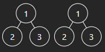
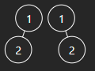
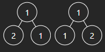

# 100. Same Tree

## Énoncé

Étant donné les racines de deux arbres binaires `p` et `q`, écrivez une fonction pour vérifier si elles sont identiques ou non.

Deux arbres binaires sont considérés comme identiques s’ils sont structurellement identiques et que les nœuds ont la même valeur.

## Exemple

**Exemple 1:**  
  
**Input:** p = [1,2,3], q = [1,2,3]  
**Output:** true

**Exemple 2:**  
  
**Input:** p = [1,2], q = [1,null,2]  
**Output:** false

**Exemple 3:**  
  
**Input:** p = [1,2,1], q = [1,1,2]  
**Output:** false

## Contraintes

Le nombre de nœuds dans les deux arbres est compris entre `[0, 100]`.  
`-10^4 <= Node.val <= 10^4`

## Note personnelle

Ce problème était plutôt simple, étant donné ma familiarité avec les arbres. Je n'ai pas rencontré de difficultés techniques majeures.

Cependant, en parcourant les solutions proposées par la communauté, j'ai remarqué qu'ils utilisaient principalement des approches récursives, contrairement à la mienne qui était itérative. Leur approche a permis d'améliorer l'utilisation de la mémoire dans leurs algorithmes.

