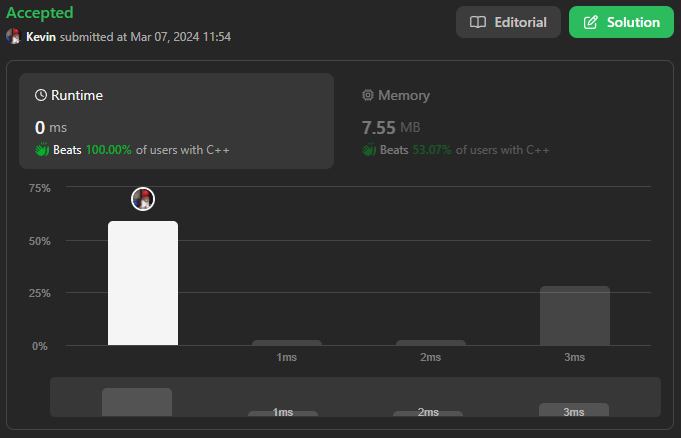
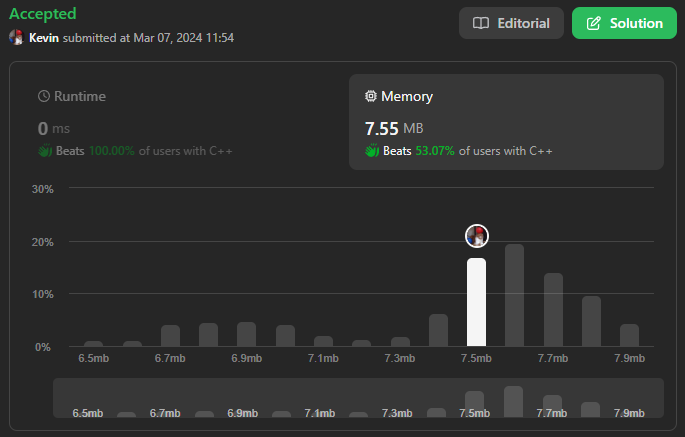

# 119. Pascal's Triangle II

## Énoncé

Étant donné un entier `rowIndex`, retournez la `rowIndex`-ème rangée (**indexée à partir de 0**) du **triangle de Pascal.**.

Dans le **triangle de Pascal**, chaque nombre est la somme des deux nombres directement au-dessus, comme indiqué:

## Exemple

**Exemple 1:**  
**Input:** rowIndex = 3  
**Output:** [1,3,3,1]

**Exemple 2:**  
**Input:** rowIndex = 0  
**Output:** [1]

**Exemple 2:**  
**Input:** rowIndex = 1  
**Output:** [1, 1]

## Contraintes

`0 <= rowIndex <= 33`

## Note personnelle

J'ai revisité mon code utilisé pour résoudre l'exercice [118. Pascal's Triangle](../0118.%20Pascal's%20Triangle/readme.md).

Voici les ajustements que j'ai effectués:

- J'ai adapté le code pour tenir compte du fait que le paramètre est indexé à partir de 0, tandis que dans l'exercice précédent, il était indexé à partir de 1.
- La valeur de retour n'est plus l'ensemble complet du triangle, mais seulement une ligne.

La complexité temporelle et spatiale est de `O(n^2)`.

