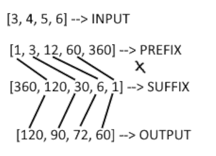
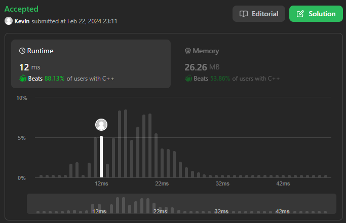

# 238. Product of Array Except Self

## Énoncé

Étant donné un tableau d'entiers `nums`, renvoie un tableau `answer` tel que `answer[i]` est égal au produit de tous les éléments de `nums` sauf `nums[i]`.

Le produit de tout préfixe ou suffixe de `nums` est **garanti** pour tenir dans un entier **32-bit**.

Vous devez écrire un algorithme qui s'exécute en un temps `O(n)` et sans utiliser l'opération de division.

Pouvez-vous résoudre le problème avec une complexité d'espace supplémentaire de `O(1)` ?  
(Le tableau de sortie **n'est pas** considéré comme un espace supplémentaire pour l'analyse de la complexité d'espace.)

## Exemple

**Example 1:**  
**Input:** nums = [1,2,3,4]  
**Output:** [24,12,8,6]

**Example 2:**  
**Input:** nums = [-1,1,0,-3,3]  
**Output:** [0,0,9,0,0]

## Contraintes

`2 <= nums.length <= 10^5`  
`-30 <= nums[i] <= 30`  
Le produit de tout préfixe ou suffixe de `nums` est **garanti** pour tenir dans un entier **32-bit**.

## Note personnelle

Ce problème présente un défi intéressant, notamment avec la contrainte d'éviter l'utilisation de l'opérateur de division, ce qui rend la tâche plus complexe.

Ayant déjà résolu des problèmes similaires dans le chapitre "Structures de données et Balayages" sur [France IOI](https://www.france-ioi.org/), j'ai rapidement eu l'intuition qu'il était nécessaire de précalculer des résultats pour parvenir à une solution optimale.

L'idée générale était de calculer le "Prefix Product" et le "Suffix Product" des éléments du tableau. En effectuant cela et en multipliant un élément de chaque tableau correspondant, je pourrais obtenir le résultat final en excluant `nums[i]`



Comme on peut le voir sur l'image précédente, j'ai ajouté le nombre 1 au début du tableau "prefix", de même qu'à la fin du tableau "suffix". Cela simplifie l'écriture de l'algorithme.

```cpp
vector<int> productExceptSelf(vector<int>& nums) {
  vector<int> prefix(nums.size() + 1);
  vector<int> suffix(nums.size() + 1);
  vector<int> output(nums.size());

  prefix[0] = 1;
  suffix[nums.size()] = 1;

  for (int i = 0; i < nums.size(); i++) {
    prefix[i + 1] = prefix[i] * nums[i];
    suffix[nums.size() - 1 - i] =
    suffix[nums.size() - i] * nums[nums.size() - 1 - i];
  }

  for (int i = 0; i < nums.size(); i++) {
    output[i] = prefix[i] * suffix[i + 1];
  }

  return output;
}
```

Cette solution a une complexité temporelle de `O(n)` et une complexité spatiale de `O(n * 2)` si l'on exclut le tableau de sortie comme décrit dans l'énoncé. Cela ne satisfait pas la contrainte d'avoir un algorithme avec une complexité spatiale de `O(1)` en excluant le tableau de sortie.

Pour améliorer cela, j'ai décidé de calculer le préfixe et de le stocker directement dans le tableau de sortie. En itérant une dernière fois sur `nums1`, je calcule le suffixe, effectue les opérations nécessaires, et stocke le résultat final dans le tableau de sortie. Avec cette approche, j'obtiens une complexité spatiale de `O(n)`, qui devient `O(1)` si l'on exclut le tableau de sortie.



