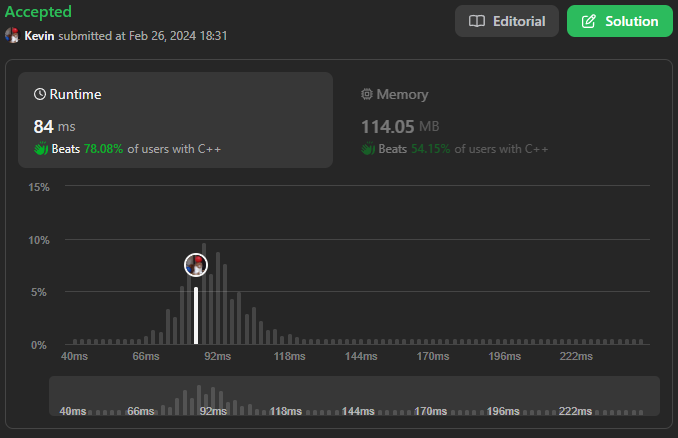

# 334. Increasing Triplet Subsequence

## Énoncé

Étant donné un tableau d'entiers `nums`, renvoie `true` s'il existe un triplet d'indices `(i, j, k)` tel que `i < j < k` et `nums[i] < nums[j] < nums[k]`. Si aucun indice de ce type n'existe, renvoyez `false`.

Pourriez-vous implémenter une solution qui s'exécute dans une complexité temporelle O(n) et une complexité spatiale O(1) ?

## Exemple

**Exemple 1:**  
**Input:** nums = [1,2,3,4,5]  
**Output:** true  
**Explication:** Tout triplet où i < j < k est valide.

**Exemple 2:**  
**Input:**  
**Explication:** Aucun triplet n'existe.

**Exemple 3:**  
**Input:** nums = [2,1,5,0,4,6]  
**Output:** true  
**Explication:** Le triplet (3, 4, 5) est valide car nums[3] == 0 < nums[4] == 4 < nums[5] == 6.

**Exemple 4:**  
**Input:** nums = [1, 5, 0, 4, 1, 3]  
**Output:** true  
**Explication:** Le triplet (2, 4, 5) est valide car nums[2] == 0 < nums[4] == 1 < nums[5] == 3.

## Contraintes

`1 <= nums.length <= 5 * 10^5`  
`-2^31 <= nums[i] <= 2^31 - 1`

## Note personnelle

Ce problème peut sembler simple de prime abord, mais parvenir à le résoudre avec une complexité temporelle de O(n) et une complexité spatiale de O(1) le rend véritablement complexe sans la bonne intuition.

L'idée m'est venue du constat que s'il existe un triplet croissant dans le tableau, alors il doit exister deux valeurs, disons a et b, telles que a < b. L'algorithme maintient ainsi une trace des deux plus petites valeurs rencontrées et dès qu'une valeur trouvée dépasse B (initialisé à INT_MAX), cela signifie qu'un triplet existe dans le tableau.

Le triplet n'est pas forcément composé de a, b, et c (où c est la valeur actuellement examinée), car la valeur de a peut être mise à jour entre-temps. Cependant, cela n'affecte pas le résultat final.

