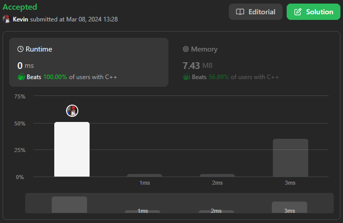
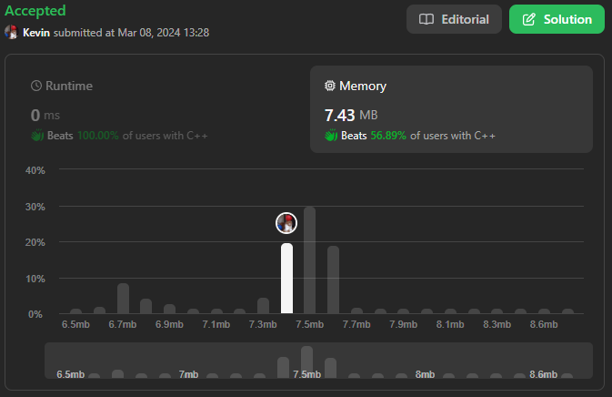

# 392. Is Subsequence

## Énoncé

Étant donné deux chaînes `s` et `t`, renvoie `true` si `s` est une **sous-séquence** de `t`, ou `false` sinon.

Une **sous-séquence** d'une chaîne est une nouvelle chaîne formée à partir de la chaîne d'origine en supprimant certains caractères (peut-être aucun) sans perturber les positions relatives des caractères restants. (c'est-à-dire que `"ace"` est une sous-séquence de `"abcde"` alors que `"aec"` ne l'est pas).

## Exemple

**Exemple 1:**  
**Input:** s = "abc", t = "ahbgdc"  
**Output:** true

**Exemple 2:**  
**Input:** s = "axc", t = "ahbgdc"  
**Output:** false

## Contraintes

`0 <= s.length <= 100`  
`0 <= t.length <= 10^4`  
`s` et `t` se composent uniquement de lettres anglaises minuscules.

## Note personnelle

Pour résoudre ce problème, j'ai adopté une approche basée sur l'utilisation de deux pointeurs, l'un pour parcourir la chaîne `t` (que j'ai nommé `i`) et l'autre pour la chaîne `s` (que j'ai appelé `indexSub`).

Mon algorithme itère à travers chaque élément de la chaîne `t` , comparant à chaque itération si `s[indexSub] == t[i]`. Si cette condition est vérifiée, j'incrémente `indexSub` de 1.

À la fin de la boucle, je vérifie si `indexSub` est égal à la taille de `s`.

Cette approche garantit une complexité temporelle de `O(n)` et une complexité spatiale de `O(1)`, où `n` représente la longueur de la chaîne `t`.

