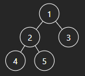
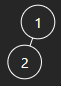
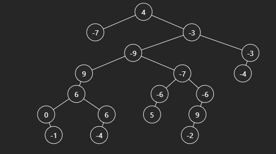
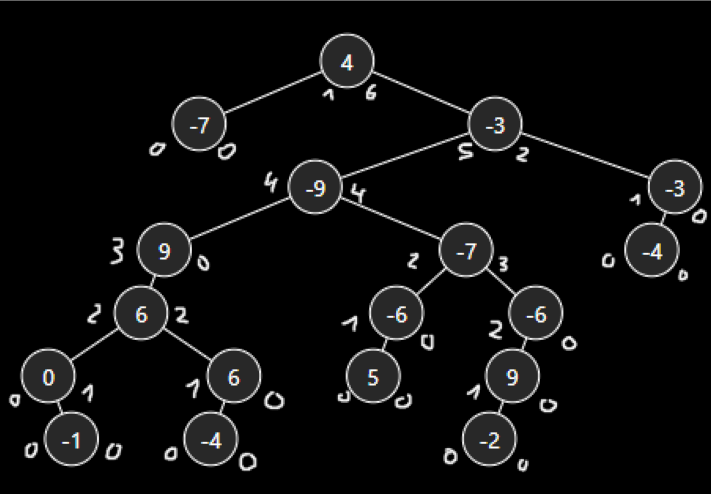

# 543. Diameter of Binary Tree

## Énoncé

Étant donné la `root` d'un arbre binaire, renvoie la longueur du **diamètre** de l'arbre.

Le **diamètre** d'un arbre binaire est la **longueur** du chemin le plus long entre deux nœuds quelconques dans un arbre. Ce chemin peut ou non passer par la `root`.

La **longueur** d'un chemin entre deux nœuds est représentée par le nombre d'arêtes entre eux.

## Exemple

**Exemple 1:**  
  
**Input:** root = [1,2,3,4,5]  
**Output:** 3  
**Explication:** 3 est la longueur du chemin [4,2,1,3] ou [5,2,1,3].

**Exemple 2:**  
  
**Input:** root = [1,2]  
**Output:** 1

**Exemple 3:**  
  
**Input:** root = [4, -7, -3, null, null, -9, -3, 9, -7, -4, null, 6, null, -6, -6, null, null, 0, 6, 5, null, 9, null, null, -1, -4, null, null, null, -2]  
**Output:** 8  
**Explication**:
8 est la longueur du chemin [-1, 0, 6, 9, -9, -7, -6, 9, -2] (Il y a d'autres chemin de même longueur).

## Contraintes

Le nombre de nœuds dans l'arborescence est compris entre `[1, 10^4]`.  
`-100 <= Node.val <= 100`

## Note personnelle

Exercice intéressant qui m'a confronté à une problématique à laquelle je n'avais jamais été opposé auparavant : trouver la distance maximale entre deux noeuds dans un arbre.

Pour résoudre ce problème, j'ai envisagé une approche consistant à partir des feuilles de l'arbre et à remonter en comptant les profondeurs des branches gauche et droite à chaque nœud.

En suivant cette méthode, il ne restait plus qu'à additionner les profondeurs gauche et droite à chaque étape et à garder une trace de la somme maximale rencontrée.

Étant donné que je n'avais pas accès directement aux feuilles de l'arbre et que la structure des noeuds ne permettait pas une remontée directe, j'ai dû recourir à une fonction récursive. Cela m'a permis de tirer parti de la pile d'appels créée par la récursion pour parcourir l'arbre des feuilles jusqu'à la racine.

La complexité temporelle de cette approche est de O(n), et la complexité spatiale est de O(n) dans le pire des cas.

