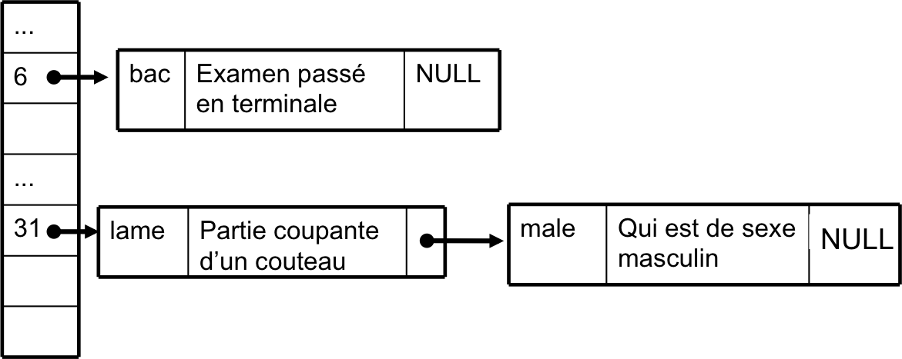
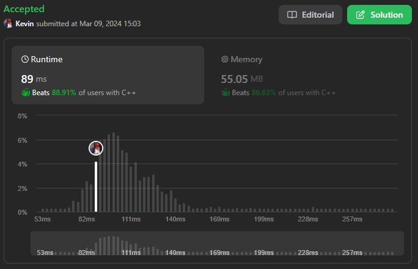
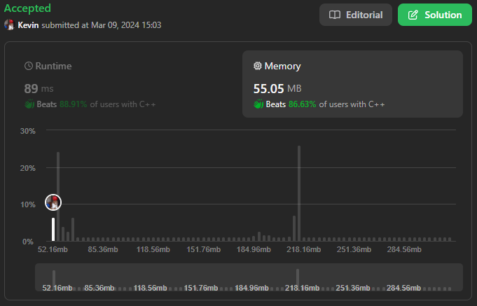

# 706. Design HashMap

## Énoncé

Concevez un HashMap sans utiliser de bibliothèques de tables de hachage intégrées.

Implémentez la classe `MyHashMap`:

- `MyHashMap()` initialise l'objet avec une map vide.
- `void put(int key, int value)` insère une paire `(key, value)` dans la HashMap. Si la `key` existe déjà dans la map, mettez à jour la `value` correspondante.
- `int get(int key)` renvoie la `value` à laquelle la clé spécifiée est mappée, ou `-1` si cette map ne contient aucun mappage pour la `key`.
- `void remove(key)` supprime la `key` et sa `value` correspondante si la map contient le mappage de la `key`.

## Exemple

**Exemple 1:**  
**Input:**  
["MyHashMap", "put", "put", "get", "get", "put", "get", "remove", "get"]  
[[], [1, 1], [2, 2], [1], [3], [2, 1], [2], [2], [2]]  
**Output:**  
[null, null, null, 1, -1, null, 1, null, -1]  
**Explication:**  
MyHashMap myHashMap = new MyHashMap();  
myHashMap.put(1, 1); // La map est maintenant [[1,1]]  
myHashMap.put(2, 2); // La map est maintenant [[1,1], [2,2]]  
myHashMap.get(1); // return 1  
myHashMap.get(3); // return -1 (c'est-à-dire introuvable)  
myHashMap.put(2, 1); // La map est maintenant [[1,1], [2,1]] (mettre à jour la valeur existante)  
myHashMap.get(2); // return 1  
myHashMap.remove(2); // supprimer le mappage pour 2, La map est maintenant [[1,1]]  
myHashMap.get(2); // return -1 (c'est-à-dire introuvable)

## Contraintes

`0 <= key, value <= 10^6`  
Au plus `10^4` appels seront effectués vers `put`, `get`, et `remove`.

## Note personnelle

Cet exercice s'est révélé particulièrement captivant, les hashmaps sont une structure très utile et comprendre leur fonctionnement interne permet de saisir leurs limites et d'éviter les erreurs courantes lors de leur utilisation.

Avant d'aborder cet exercice, je n'avais qu'une connaissance superficielle du fonctionnement interne des hashmaps. Par conséquent, j'ai entrepris des recherches pour le comprendre et l'implémenter.

J'ai opté pour le hachage par chaînage semblable aux `unordered_map` de c++.

L'idée principale consiste à utiliser un tableau de pointeurs, pointant vers des listes chaînées. À chaque opération de recherche, d'insertion ou de suppression, nous hashons la clé, et le résultat du hachage nous donne l'index de la liste chaînée correspondante. J'ai choisi arbitrairement une taille de vecteur de 1024.

Schéma représentant une table de hachage par chaînage pour des mots avec leurs définition.


La structure des noeuds de ma liste chaînée est la suivante :

```cpp
struct Node {
  int key;
  int value;
  Node *next;
};
```

Étant donné que nous manipulons des entiers pour cet exercice, ma fonction de hachage est assez simple:

```cpp
int hash(int key) {
  return key % this->size;
}
```

J'ai mis en place une méthode permettant de récupérer le pointeur d'une clé. Cela évite la répétition de code dans les différentes méthodes.

```cpp
Node *isKeyExist(int key, int h) {
  Node *current = this->arr[h]; // Début de la chaîne de noeud à l'index h

  // Parcours de la chaîne jusqu'à trouver la clé ou la fin de la chaîne
  while (current && current->key != key) {
    current = current->next;
  }

  // Retourne le noeud s'il existe, sinon nullptr
  return current;
}
```

La méthode `put` commence par calculer le hachage de `key` à l'aide de la fonction `hash` puis récupère le noeud de la liste chaînée correspondant grâce à la méthode `isKeyExist`.
Si un noeud est trouvé, elle met simplement à jour sa valeur, sinon elle crée un nouveau noeud et l'ajoute au début de la liste chaînée correspondant au hachage.

```cpp
void put(int key, int value) {
  int h = this->hash(key); // Calcul de l'index dans la table de hachage
  Node *node = this->isKeyExist(key, h); // Vérifie si la clé existe déjà

  if (node) {
    node->value = value; // Met à jour la valeur si la clé existe déjà
  }
  else {
    // Crée un nouveau noeud avec la paire clé-valeur
    node = new Node(key, value, this->arr[h]);
    // Met à jour la tête de la chaîne à l'index h
    this->arr[h] = node;
  }
}
```

La méthode `get` fonctionne de manière similaire à `put` mais elle retourne la valeur si un noeud est trouvé, sinon elle retourne `-1`.

```cpp
int get(int key) {
  int h = this->hash(key); // Calcul de l'index dans la table de hachage
  Node *node = this->isKeyExist(key, h); // Vérifie si la clé existe

  if (node) {
    return node->value; // Retourne la valeur si la clé existe
  }
  return -1; // Retourne -1 si la clé n'existe pas
}
```

Dans la méthode `remove`, il y a une certaine redondance de code, qui aurait pu être évitée si j'avais modifié la structure des noeuds de ma liste chaînée pour permettre de remonter en arrière.

Cette méthode récupère donc le noeud correspondant à la `key` tout en gardant une trace du nœud précédent. Ensuite, il y a différents cas de suppression:

- Si `prev` est `nullptr` et que `current != nullptr`, alors notre valeur se trouve au début de la liste chaînée.
- Sinon, si `current != nullptr`, notre valeur à supprimer se trouve ailleurs dans la liste.
- Sinon, notre valeur n'existe pas dans la liste.

Après la suppression, il est important de libérer la mémoire.

```cpp
void remove(int key) {
  int h = this->hash(key); // Calcul de l'index dans la table de hachage
  Node *current = this->arr[h]; // Début de la chaîne de noeud à l'index h
  Node *prev = nullptr; // Pointeur vers le noeud précédent

  // Parcours de la chaîne jusqu'à trouver la clé ou la fin de la chaîne
  while (current && current->key != key) {
    prev = current;
    current = current->next;
  }

  // Gestion des différents cas de suppression
  if (!prev && current) {
    // Si le noeud à supprimer est en tête de la chaîne
    this->arr[h] = current->next;
  }
  else if (current) {
    prev->next = current->next; // Si le noeud à supprimer est au milieu de la chaîne
  }
  else {
    return; // Si la clé n'existe pas dans la table de hachage
  }

  delete current; // Libère la mémoire du noeud supprimé
}
```

En conclusion, la complexité temporelle de `put`, `get` et `remove` peut être considérée comme `O(1)`, mais dans le pire des cas (lorsque toutes les clés ont le même hachage), la complexité temporelle est de `O(n)`.
. La complexité spatiale est de `O(n)`.

Une amélioration qui pourrait être apportée serait de redimensionner la table une fois qu'un certain seuil d'occupation est atteint. L'idée serait de créer un nouveau vecteur en multipliant sa taille par 2, de parcourir chaque élément de la table pour recalculer leur hachage et les insérer au bon endroit, tout en veillant à libérer la mémoire de l'ancien vecteur.



