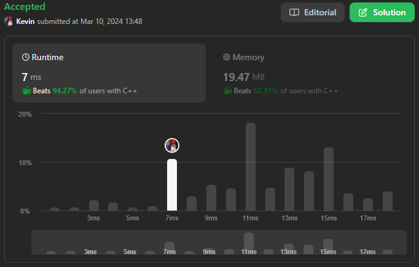

# 744. Find Smallest Letter Greater Than Target

## Énoncé

Vous recevez un tableau de caractères `letters` triés par **ordre croissant** et un caractère `target`. Il y a au moins deux caractères différents dans les `letters`.

Renvoie le plus petit caractère dans `letters` qui est lexicographiquement supérieur à `target`. Si un tel caractère n'existe pas, renvoie le premier caractère de `letters`.

## Exemple

**Exemple 1:**  
**Input:** letters = ["c","f","j"], target = "a"  
**Output:** "c"  
**Explication:** Le plus petit caractère lexicographiquement supérieur à 'a' dans letters est 'c'.

**Exemple 2:**  
**Input:** letters = ["c","f","j"], target = "c"  
**Output:** "f"  
**Explication:** The smallest character that is lexicographically greater than 'c' in letters is 'f'.

**Exemple 3:**  
**Input:** letters = ["x","x","y","y"], target = "z"  
**Output:** "x"  
**Explication:** Il n'y a aucun caractère dans les lettres qui soit lexicographiquement supérieur à 'z' nous renvoyons donc letters[0].

## Contraintes

`2 <= letters.length <= 10^4`  
`letters[i]` est une lettre anglaise minuscule.  
`letters` est trié par ordre **croissant**.  
`letters` contient au moins deux caractères différents.  
`target` est une lettre anglaise minuscule.

## Note personnelle

Ma méthode consiste à augmenter la valeur de `target` de `1`. Ensuite, en utilisant une recherche binaire, nous obtenons l'index de la plus petite lettre qui est supérieure ou égale à `target`.

Si l'indice trouvé se situe en dehors des limites du tableau, cela signifie qu'aucune lettre supérieure à la lettre `target` d'origine n'est présente dans le tableau.

Cette approche présente une complexité temporelle de `O(log n)` et une complexité spatiale de `O(1)`.

