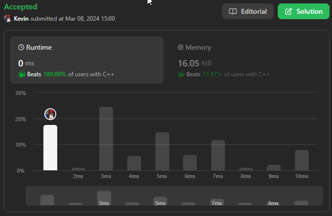
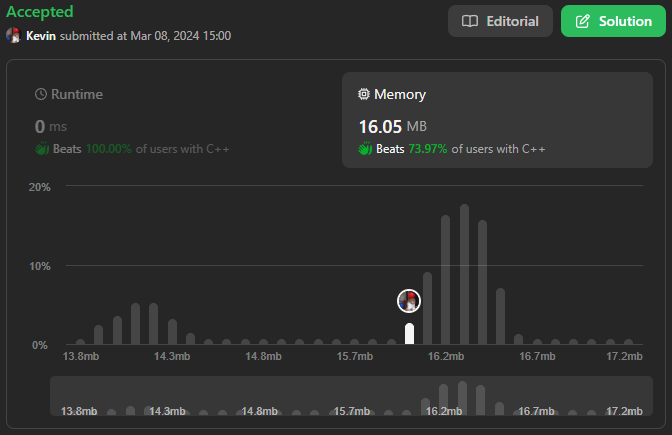

# 746. Min Cost Climbing Stairs

## Énoncé

Vous recevez un tableau d'entiers `cost` où `cost[i]` st le coût de la `ième` marche d'un escalier. Une fois le prix payé, vous pouvez monter une ou deux marches.

Vous pouvez soit commencer à partir de l'étape avec l'index `0`, soit à partir de l'étape avec l'index `1`.

Renvoie le coût minimum pour atteindre le haut de l'étage.

## Exemple

**Exemple 1:**  
**Input:** cost = [10,15,20]  
**Output:** 15  
**Explication:** Vous commencerez à l'index 1.

- Payez 15 et montez deux marches pour atteindre le sommet.

Le coût total est de 15.

**Exemple 2:**  
**Input:** cost = [1,100,1,1,1,100,1,1,100,1]  
**Output:** 6  
**Explication:** Vous commencerez à l'index 0.

- Payez 1 et montez deux marches pour atteindre l'index 2.
- Payez 1 et montez deux marches pour atteindre l'index 4.
- Payez 1 et montez deux marches pour atteindre l'index 6.
- Payez 1 et montez une marche pour atteindre l'index 7.
- Payez 1 et montez deux marches pour atteindre l'index 9.
- Payez 1 et montez une marche pour atteindre le sommet.

Le coût total est de 6.

## Contraintes

`2 <= cost.length <= 1000`  
`0 <= cost[i] <= 999`

## Note personnelle

Ma première approche implique l'utilisation d'un tableau dynamique nommé `dp` de taille `cost.size() + 1`, où la valeur initiale est définie comme `dp[0] = 0` et `dp[1] = cost[0]`.

Je parcours ensuite de l'indice `2` jusqu'à `cost.size()` inclus. À chaque itération, je calcule le coût pour atteindre la marche `i` selon la formule suivante: `dp[i] = min(dp[i - 2], dp[i - 1]) + cost[i - 1]`.  
Explorons cette formule en détail:

- `min(dp[i - 2], dp[i - 1])` permet de sélectionner le coût minimum entre le coût pour atteindre l'une des deux marches précédentes.
- `cost[i - 1]` permet de récupérer le coût de la marche actuelle.

```cpp
int minCostClimbingStairs(vector<int>& cost) {
  // Initialisation d'un tableau dynamique dp avec une taille de (nombre d'éléments dans cost + 1)
  vector<int> dp(cost.size() + 1);

  // Initialisation de dp[1] avec le coût du premier escalier
  dp[1] = cost[0];

  // Parcours à partir de la deuxième position jusqu'à la fin de cost
  for(int i = 2; i <= cost.size(); i++){
    // Calcul du coût minimal pour atteindre l'escalier actuel (i) en comparant
    // le coût de passer de l'escalier précédent (i - 1) ou de l'escalier avant le précédent (i - 2)
    dp[i] = min(dp[i - 2], dp[i - 1]) + cost[i - 1];
  }

  // Retourne le coût minimal pour atteindre le sommet de l'escalier en partant de la base
  return min(dp[cost.size()], dp[cost.size() - 1]);
}
```

La complexité temporelle et spatiale de cette approche est de `O(n)`.

Ma seconde approche simplifie l'approche précédente en abandonnant l'utilisation du tableau pour stocker les résultats intermédiaires. Au lieu de cela, elle utilise simplement deux variables pour stocker les deux derniers termes calculés.

Cette seconde approche a une complexité temporelle de `O(n)` et une complexité spatiale de `O(1)`.



