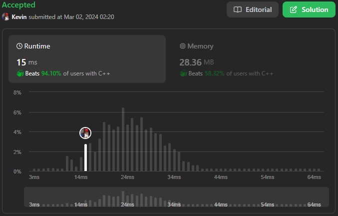

# 977. Squares of a Sorted Array

## Énoncé

Étant donné un tableau d'entiers `nums` triés dans un ordre **non décroissant**, renvoie un tableau des **carrés de chaque nombre** triés dans un ordre non décroissant.

Mettre au carré chaque élément et trier le nouveau tableau est très trivial, pourriez-vous trouver une solution O(n) en utilisant une approche différente ?

## Exemple

**Exemple 1:**  
**Input:** nums = [-4,-1,0,3,10]  
**Output:** [0,1,9,16,100]  
**Explication:** Après la mise au carré, le tableau devient [16,1,0,9,100].
Après tri, il devient [0,1,9,16,100].

**Exemple 2:**  
**Input:** nums = [-7,-3,2,3,11]  
**Output:** [4,9,9,49,121]

## Contraintes

`1 <= nums.length <= 10^4`  
`-10^4 <= nums[i] <= 10^4`  
`nums` est trié par ordre **non décroissant**.

## Note personnelle

L'inspiration m'est venue en constatant que le tableau était trié par ordre croissant et que le carré d'un nombre négatif est positif.

La stratégie est assez simple : j'utilise deux indices, l'un suit le **plus grand** élément `< 0` non traité que j'appelle `GLZ` (Greater Less than Zeros) et l'autre suit le **plus petit** élément `>= 0` non traité que j'appelle `i`.

Si `GLZ` n'est pas égal à `-1`, je compare si `-nums[GLZ] < nums[i]`. Si c'est le cas, j'ajoute `nums[GLZ]^2` à `output`.
Je le fais également si `i == nums.size()`, ce qui signifie que toutes les valeurs positives ont déjà été traitées.

Sinon j'ajoute `nums[i]^2` à `output`.

Une micro-optimisation qui m'a permis de gagner 7ms de temps d'exécution moyen sur les jeux de tests a été de réserver à l'avance la taille du tableau `output` et de remplacer `output.push_back(valeur)` par `output[i - GLZ - 1] = valeur`.

La complexité temporelle de cette approche est de `O(n)` et la complexité spatiale de `O(n)`.

