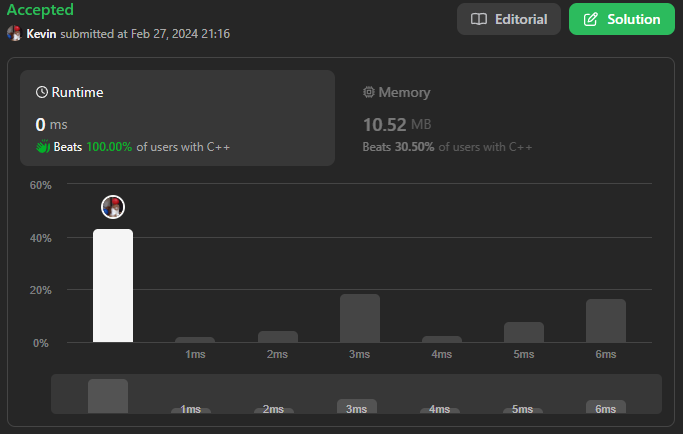

# 1480. Running Sum of 1d Array

## Énoncé

Étant donné un tableau `nums`. Nous définissons la somme courante d'un tableau comme `runningSum[i] = sum(nums[0]…nums[i])`.

Renvoie la somme cumulée de `nums`.

## Exemple

**Exemple 1:**  
**Input:** nums = [1,2,3,4]  
**Output:** [1,3,6,10]  
**Explication:** La somme cumulée est obtenue comme suit: [1, 1+2, 1+2+3, 1+2+3+4].

**Exemple 2:**  
**Input:** nums = [1,1,1,1,1]  
**Output:** [1,2,3,4,5]  
**Explication:** La somme cumulée est obtenue comme suit: [1, 1+1, 1+1+1, 1+1+1+1, 1+1+1+1+1].

**Exemple 3:**  
**Input:** nums = [3,1,2,10,1]  
**Output:** [3,4,6,16,17]

## Contraintes

`1 <= nums.length <= 1000`  
`-10^6 <= nums[i] <= 10^6`

## Note personnelle

Pas grand-chose à ajouter.

