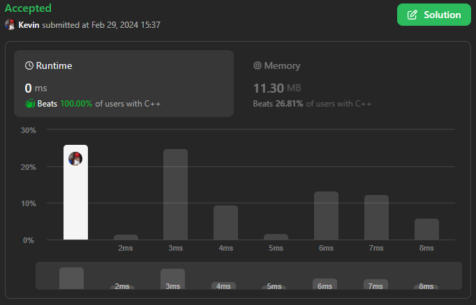
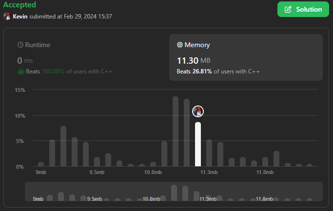

# 1893. Check if All the Integers in a Range Are Covered

## Énoncé

Vous recevez un tableau d'entiers 2D `ranges` et deux entiers `left` et `right`. Chaque élément `ranges[i] = [starti, endi]` représente un intervalle **inclusif** entre `starti` et `endi`.

Renvoie `true` si chaque entier de la plage inclusive `[left, right]` est couvert par **au moins un** intervalle dans les plages. Sinon, renvoyez `false`.

Un entier `x` est couvert par un intervalle `ranges[i] = [starti, endi]` si `starti <= x <= endi`.

## Exemple

**Exemple 1:**  
**Input:** ranges = [[1,2],[3,4],[5,6]], left = 2, right = 5  
**Output:** true  
**Explication:**  
Tout entier compris entre 2 et 5 est couvert :

- 2 est couvert par le premier intervalle.
- 3 et 4 sont couvert par le second intervalle.
- 5 est couvert par le troisième intervalle.

**Exemple 2:**  
**Input:** ranges = [[1,10],[10,20]], left = 21, right = 21  
**Output:** false  
**Explication:** 21 n’est couvert par aucune plage.

## Contraintes

`1 <= ranges.length <= 50`  
`1 <= starti <= endi <= 50`  
`1 <= left <= right <= 50`

## Note personnelle

Dans ma première approche, j'ai opté pour la création d'un marqueur pour chaque élément dans l'intervalle `[left, right]`, J'ai utilisé une structure de données de type hashmap avec comme clé un nombre de l'intervalle et une valeur booléenne. Ensuite, j'ai itéré sur les intervalles et marqué les nombres un par un.

```cpp
bool isCovered(vector<vector<int>>& ranges, int left, int right) {
  // On utilise un unordered_map pour suivre les éléments couverts.
  unordered_map<int, bool> covered;

  // Initialisation de tous les éléments de left à right comme non couverts.
  for(int i = left; i <= right; i++){
    covered[i] = false;
  }

  // Compteur pour suivre le nombre d'éléments couverts.
  int count = 0;

  // Parcours des plages pour marquer les éléments couverts.
  for(vector<int>& element : ranges){
    // Si la plage ne touche pas la plage [left, right], on l'ignore.
    if(element[1] < left || element[0] > right){
      continue;
    }
    // Parcours de chaque élément de la plage.
    for(int i = element[0]; i <= element[1]; i++){
      // Si l'élément n'est pas dans la plage [left, right], on l'ignore.
      if(covered.find(i) == covered.end()){
        continue;
      }
      // Si l'élément n'a pas encore été couvert, on le marque comme couvert et on incrémente le compteur.
      if(!covered[i]){
        covered[i] = true;
        count++;
      }
    }
  }
  // Si tous les éléments de [left, right] sont couverts, alors count doit être égal à la taille de la plage.
  return count == covered.size();
}
```

Cette approche présentait une complexité temporelle de `O(n * m)` et une complexité spatiale de `O(n)`, où n représente la longueur de l'intervalle `right-left` et m la taille du tableau `ranges`.

La dernière approche à laquelle j'ai pensé permet de se passer de la hashmap. J'itère sur l'intervalle `left` jusqu'à `right` et je vérifie si le nombre se trouve dans un intervalle du tableau `ranges`.

Cette approche présente également une complexité temporelle de `O(n * m)` mais une complexité spatiale de `O(1)`.

En examinant les solutions proposées par la communauté, je suis tombé sur une solution avec une complexité temporelle de `O(n + m)` et une complexité spatiale de `O(m)`.

L'idée était de créer un tableau d'entiers ayant pour taille le nombre maximum pouvant se trouver dans les intervalles + 1, initialisé à 0. Ensuite, on itère sur les ranges, et on incrémente la valeur dans le tableau pour `starti` et on décrémente pour `endi + 1`.

En itérant sur ce tableau jusqu'à l'indice `right` inclue, inclus, en gardant une trace de la somme totale pendant l'itération, si l'index est supérieur ou égal à `left` et que la somme est égale à `0`, , cela signifie que ce nombre n'est pas compris dans un intervalle du tableau `plage`.

```cpp
//Solution de @votrubac sur LeetCode
bool isCovered(vector<vector<int>>& ranges, int left, int right) {
    int line[52] = {};
    for (auto &r : ranges) {
        line[r[0]] += 1;
        line[r[1] + 1] -= 1;
    }
    for (int i = 1, overlaps = 0; i <= right; ++i) {
        overlaps += line[i];
        if (i >= left && overlaps == 0)
            return false;
    }
    return true;
}
```

Je n'ai bien sûr pas soumis cette solution étant donné qu'elle ne vient pas de moi, je la mets ici à titre indicatif. Le principe utilisé s'appelle "Line Sweep", que je ne connaissais pas et je tâcherai de m'en souvenir à l'avenir le jour où je travaille avec des intervalles. À noter cependant que cette méthode peut être assez coûteuse en mémoire.



