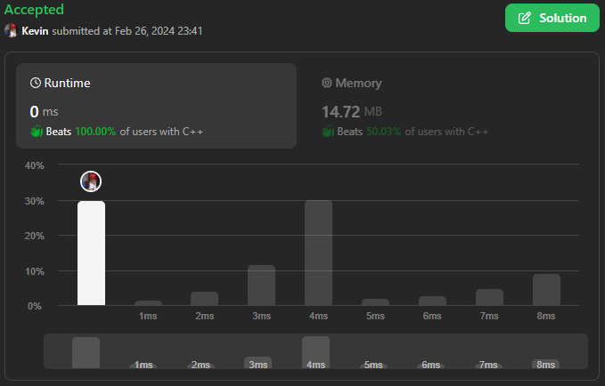
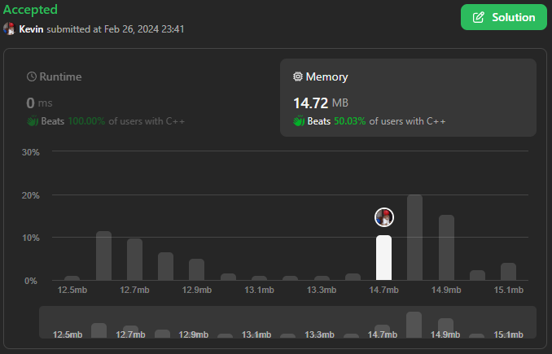

# 1991. Find the Middle Index in Array

## Énoncé

Étant donné un tableau d'entiers **indexé à 0** `nums`, recherchez le `middleIndex` **le plus à gauche** (c'est-à-dire le plus petit parmi tous les possibles).

Un `middleIndex` est un index où `nums[0] + nums[1] + ... + nums[middleIndex-1] == nums[middleIndex+1] + nums[middleIndex+2] + ... + nums [nums.length-1]`.

Si `middleIndex == 0`, la somme du côté gauche est considérée comme étant `0`. De même, si `middleIndex == nums.length - 1`, la somme du côté droit est considérée comme étant `0`.

Renvoie le `middleIndex` **le plus à gauche** qui satisfait à la condition, ou `-1` s'il n'existe pas un tel index.

Remarque : Cette question est la même que [724](https://leetcode.com/problems/find-pivot-index/)

## Exemple

**Exemple 1:**  
**Input:** nums = [2,3,-1,<ins>8</ins>,4]  
**Output:** 3  
**Explication:**  
La somme des nombres avant l'indice 3 est : 2 + 3 + -1 = 4  
La somme des nombres après l'indice 3 est : 4 = 4

**Exemple 2:**  
**Input:** nums = [1,-1,<ins>4</ins>]  
**Output:** 2  
**Explication:**  
La somme des nombres avant l'indice 2 est : 1 + -1 = 0  
La somme des nombres après l'index 2 est : 0

**Exemple 3:**  
**Input:** nums = [2,5]  
**Output:** -1  
**Explication:**  
Il n’y a pas de middleIndex valide.

## Contraintes

`1 <= nums.length <= 100`  
`-1000 <= nums[i] <= 1000`

## Note personnelle

Dans ma première approche, j'ai opté pour la création de deux vecteurs, `prefix` et `suffix`, afin de représenter les sommes cumulées depuis le début et la fin du tableau respectivement.

Ensuite, j'ai cherché à trouver un indice où `prefix[i] == suffix[i]`, ce qui indiquerait le pivot.

```cpp
int pivotIndex(vector<int>& nums) {
  vector<int> prefix(nums.size());
  vector<int> suffix(nums.size());

  prefix[0] = nums[0];
  suffix[nums.size() - 1] = nums[nums.size() - 1];

  for(int i = 1, j = nums.size() - 1 - i; i < nums.size(); i++, j--){
    prefix[i] = nums[i] + prefix[i - 1];
    suffix[j] = nums[j] + suffix[j + 1];
  }

  for(int i = 0; i < prefix.size(); i++){
    if(prefix[i] == suffix[i]){
      return i;
    }
  }

  return -1;
}
```

Cependant, après avoir soumis cette solution, j'ai réalisé que j'utilisais plus de mémoire que nécessaire, me classant parmi les 10% les moins performants en termes d'utilisation de la mémoire.

J'ai donc décidé d'optimiser l'utilisation de la mémoire. Mon intuition m'a dirigé vers la conclusion que seul le tableau `prefix` était nécessaire. En examinant de plus près ce tableau, j'ai remarqué que l'indice pivot devait respecter la condition suivante : `prefix[i] + prefix[i - 1] == prefix[prefix.size() - 1]`.

Cependant, cette approche introduit quelques cas spéciaux plus complexes à gérer par rapport à la première approche :

- Le premier cas à traiter survient lorsque le tableau a une taille de 1, dans ce cas, le pivot est simplement 0.

- Le deuxième cas concerne le pivot situé à l'index 0. J'ai trouvé un moyen de le détecter en vérifiant si le dernier élément de `prefix` a la même valeur que son premier élément. Puisque le pivot est exclu des calculs, la somme cumulée est 0 pour la partie droite, et comme il n'y a aucun élément à gauche, cela donne également 0.

- Le troisième cas intervient lorsque le pivot est sur le dernier index du tableau. Je le détecte en vérifiant si l'élément précédant est 0. Cette vérification est effectuée après la boucle, car l'énoncé demande à trouver le pivot le plus à gauche, et dans certains cas, un pivot peut être trouvé avant lui.

J'ai également économisé de la mémoire en stockant les sommes cumulées dans `nums`

Les deux solutions ont une complexité temporelle de `O(n)` et une complexité spatiale de `O(n)`. Cependant, la deuxième approche utilise moins de mémoire et évite la création de vecteurs, ce qui permet également de gagner un peu en temps d'exécution.



