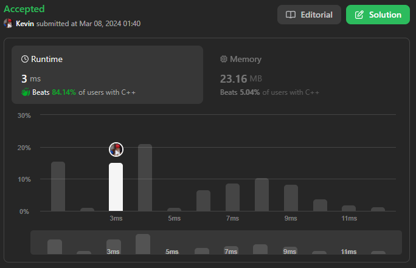
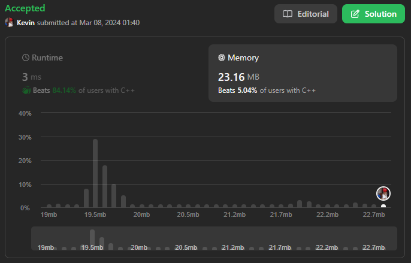

# 3005. Count Elements With Maximum Frequency

## Énoncé

Vous recevez un tableau `nums` composé d'entiers **positifs**.

Renvoie les **fréquences totales** des éléments dans `nums` tels que ces éléments aient tous la fréquence **maximale**.

La **fréquence** d'un élément est le nombre d'occurrences de cet élément dans le tableau.

## Exemple

**Exemple 1:**  
**Input:** nums = [1,2,2,3,1,4]  
**Output:** 4  
**Explication:** Les éléments 1 et 2 ont une fréquence de 2 qui est la fréquence maximale du tableau.
Le nombre d’éléments dans le tableau avec une fréquence maximale est donc de 4.

**Exemple 2:**  
**Input:** nums = [1,2,3,4,5]  
**Output:** 5  
**Explication:** Tous les éléments du tableau ont une fréquence de 1 qui est le maximum.
Le nombre d’éléments dans le tableau avec une fréquence maximale est donc de 5.

## Contraintes

`1 <= nums.length <= 100`  
`1 <= nums[i] <= 100`

## Note personnelle

Ma stratégie repose sur l'utilisation d'un hashmap pour suivre le nombre d'occurrences de chaque élément distinct dans `nums`. Je maintiens deux variables, `maxFrequency` et `countMaxFrequency`, pour enregistrer respectivement la fréquence maximale d'apparition et le nombre d'éléments distincts ayant cette fréquence maximale.

Cette méthode présente une complexité temporelle et spatiale de `O(n)`.

