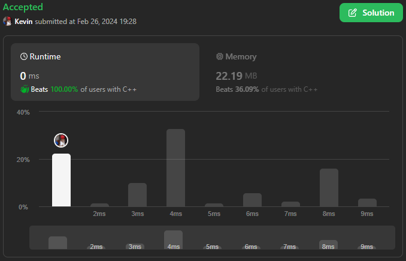
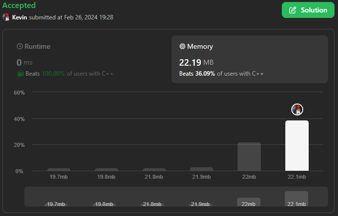

# 3028. Ant on the Boundary

## Énoncé

Une fourmi est sur une frontière. Elle va parfois à **gauche** et parfois à **droite**.

Vous recevez un tableau d'entiers **non nuls** `nums`. La fourmi commence à lire `nums` depuis le premier élément jusqu'à sa fin. A chaque étape, elle se déplace en fonction de la valeur de l'élément courant :

Si `nums[i] < 0`, elle se déplace vers la gauche de `-nums[i]` unités.  
Si `nums[i] > 0`, elle se déplace vers la droite de `nums[i]` unités.  
Renvoie le nombre de fois que la fourmi **revient** à la frontière.

**Notes:**

Il y a un espace infini des deux côtés de la frontière.  
Nous vérifions si la fourmi est sur la frontière seulement après avoir déplacé `|nums[i]|` d'unités. Autrement dit, si la fourmi franchit la frontière lors de son déplacement, cela ne compte pas.

## Exemple

**Exemple 1:**  
**Input:** nums = [2,3,-5]  
**Output:** 1  
**Explication:** Après le premier pas, la fourmi se trouve 2 pas à droite de la limite.
Après le deuxième pas, la fourmi se trouve 5 pas à droite de la limite.
Après la troisième étape, la fourmi se trouve à la limite.
La réponse est donc 1.

**Exemple 2:**  
**Input:** nums = [3,2,-3,-4]  
**Output:** 0  
**Explication:** Après le premier pas, la fourmi se trouve 3 pas à droite de la limite.
Après le deuxième pas, la fourmi se trouve 5 pas à droite de la limite.
Après le troisième pas, la fourmi se trouve 2 pas à droite de la limite.
Après le quatrième pas, la fourmi se trouve 2 pas à gauche de la limite.
La fourmi n’est jamais revenue à la frontière, donc la réponse est 0.

## Contraintes

`1 <= nums.length <= 100`  
`-10 <= nums[i] <= 10`  
`nums[i] != 0`

## Note personnelle

