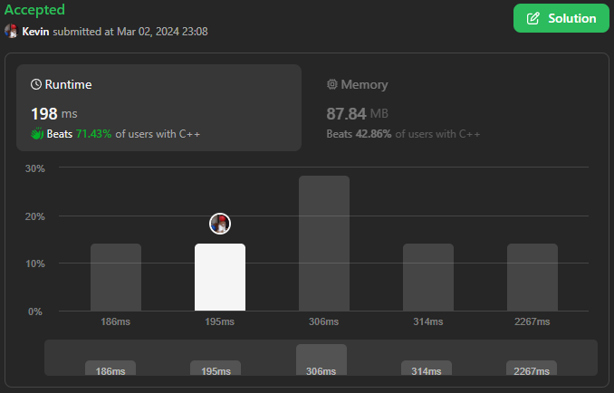
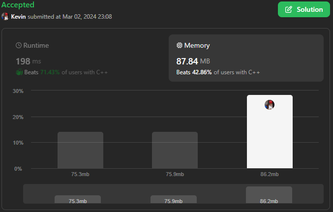

# 3066. Minimum Operations to Exceed Threshold Value II

## Énoncé

Vous recevez un tableau d'entiers **indexés à 0** `nums` et un entier `k`.

En une seule opération, vous allez :

- Prenez les deux plus petits entiers `x` et `y` dans `nums`.
- Supprimez `x` et `y` de `nums`.
- Ajoutez `min(x, y) * 2 + max(x, y)` n'importe où dans le tableau.

**Notez** que vous ne pouvez appliquer l'opération décrite que si nums contient au moins deux éléments.

Renvoie le nombre **minimum** d'opérations nécessaires pour que tous les éléments du tableau soient supérieurs ou égaux à `k`.

## Exemple

**Exemple 1:**  
**Input:** nums = [2,11,10,1,3], k = 10  
**Output:** 2  
**Explication:**  
Dans la première opération, nous supprimons les éléments 1 et 2, puis ajoutons 1 \* 2 + 2 à nums.  
nums devient égal à [4, 11, 10, 3].  
Dans la deuxième opération, nous supprimons les éléments 3 et 4, puis ajoutons 3 \* 2 + 4 à nums.  
nums devient égal à [10, 11, 10].  
A ce stade, tous les éléments de nums sont supérieurs ou égaux à 10 donc on peut s'arrêter.

**Exemple 2:**  
**Input:** nums = [1,1,2,4,9], k = 20  
**Output:** 4  
**Explication:**  
Après une opération, nums devient égal à [2, 4, 9, 3].  
Après deux opérations, nums devient égal à [7, 4, 9].  
Après trois opérations, nums devient égal à [15, 9].  
Après quatre opérations, nums devient égal à [33].  
A ce stade, tous les éléments de nums sont supérieurs à 20 donc on peut s'arrêter.

## Contraintes

`2 <= nums.length <= 2 * 10^5`  
`1 <= nums[i] <= 10^9`  
`1 <= k <= 10^9`  
L'entrée est générée de telle sorte qu'une réponse existe toujours. Autrement dit, il existe une séquence d'opérations après laquelle tous les éléments du tableau sont supérieurs ou égaux à `k`.

## Note personnelle

Ma méthode repose sur l'utilisation d'une file de priorité, ce qui présente l'avantage de maintenir le tableau trié tout en permettant l'ajout d'éléments avec une complexité de `O(log n)`

J'ai opté pour le type `uint32_t`, bien qu'il ne soit théoriquement pas suffisant pour stocker le résultat de l'opération `min(x,y) * 2 + max(x,y)` lorsque `y` approche de la limite de ce type. Pour remédier à ce problème, j'ai ajouté une condition de sortie lorsque `y >= k`.

Illustrons cela avec un exemple:
`nums` = [999999999,999999999,999999999]  
`k` = 1000000000  
Après une opération, `nums` devient égal à [999999999, 2999999997].  
La prochaine opération donnera comme résultat 4999999995, ce qui dépasse la limite de `uint32_t`. Étant donné que `k` a une valeur maximale de 10^9, ce problème est facilement détectable.
En utilisant `uint32_t` au lieu d'un `long long` je peux économiser un peu de mémoire au détriment de quelques millisecondes de temps d'exécution pour la condition supplémentaire.

Complexité temporelle: `O(n log n)`  
Complexité spatiale: `O(n)`

