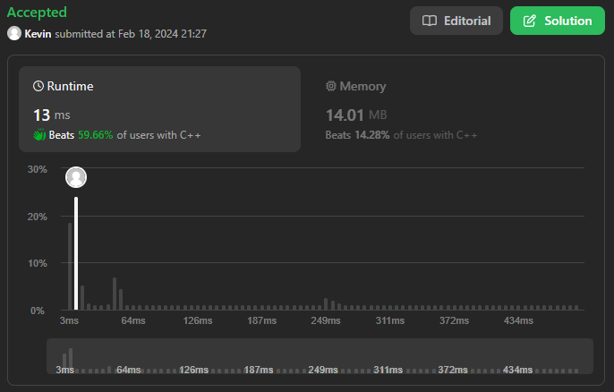
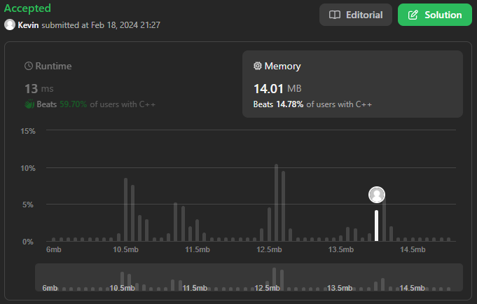

# 1. Two Sum

## Énoncé

Étant donné un tableau d'entiers `nums` et un entier `target`, retournez les indices des deux nombres tels que leur somme est égale à `target`.

Vous pouvez supposer qu'il existe exactement **une solution**, pour chaque entrée, et vous ne pouvez pas utiliser le même élément deux fois.

Vous pouvez retourner la réponse dans n'importe quel ordre.

Pouvez-vous proposer un algorithme dont la complexité temporelle est inférieure à `O(n^2)` ?

## Exemple

**Exemple 1:**  
**Input:** nums = [2,7,11,15], target = 9  
**Output:** [0,1]  
**Explication:** Parce que nums[0] + nums[1] == 9, nous renvoyons [0, 1].

**Exemple 2:**  
**Input:** nums = [3,2,4], target = 6  
**Output:** [1,2]

**Exemple 3:**  
**Input:** nums = [3,3], target = 6  
**Output:** [0,1]

## Contraintes

`2 <= nums.length <= 10^4`  
`-10^9 <= nums[i] <= 10^9`  
`-10^9 <= target <= 10^9`

Une seule réponse valide existe.

## Note personnelle

Malgré sa simplicité globale, cet exercice s'avère intéressant en raison du défi supplémentaire posé par la demande de maintenir une complexité inférieure à O(n^2).

