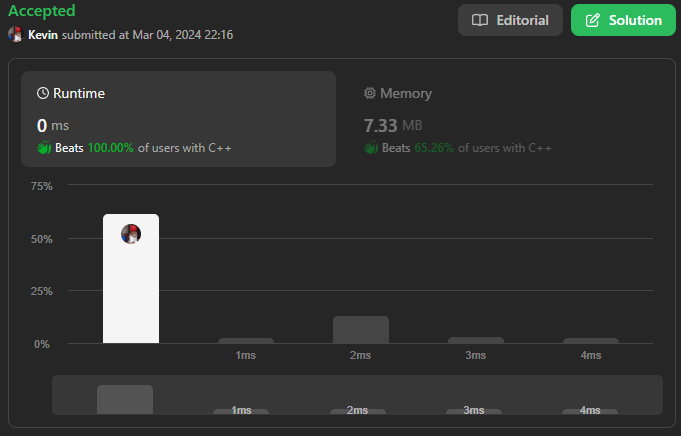

# 7. Reverse Integer

## Énoncé

Étant donné un entier signé de 32 bits `x`, renvoie `x` avec ses chiffres inversés. Si l'inversion de `x` fait sortir la valeur de la plage d'entiers signés de 32 bits `[-2^31, 2^31 - 1]`, alors renvoyez `0`.

**Supposons que l'environnement ne vous permet pas de stocker des entiers 64 bits (signés ou non signés).**

## Exemple

**Exemple 1:**  
**Input:** x = 123  
**Output:** 321

**Exemple 2:**  
**Input:** x = -123  
**Output:** -321

**Exemple 3:**  
**Input:** x = 120  
**Output:** 21

## Contraintes

`-2^31 <= x <= 2^31 - 1`

## Note personnelle

Mon approche initiale pour résoudre ce problème est relativement simple. Tout d'abord, je convertis `x` en une chaîne de caractères nommée `s`, puis j'inverse cette chaîne en tenant compte de son signe initial. Si `x` est positif, je commence au début de la chaîne, sinon, je commence à partir du deuxième caractère.

Pour vérifier si le nombre ne dépasse pas la taille d'un int32, je vérifie la longueur de `s`:

- Si `x` est positif et que `s` a une longueur de `10` caractères, je la compare à la chaîne `"2147483647"`, qui représente la valeur maximale d'un int32.
- Si `x` est négatif et que `s` a une longueur de `11` caractères (car il contient le signe `-`), je la compare à la chaîne `"-2147483647"`, qui représente la valeur minimale d'un int32.

Pour effectuer cette comparaison, j'utilise simplement l'opérateur `>`, qui compare les caractères en utilisant leur valeur ASCII. Cette méthode fonctionne bien car `'0' < '1' = true`, ect.

Ensuite, je convertis la chaîne `s` en un entier et je retourne cette valeur, ou bien je retourne `0` si elle dépasse la capacité d'un int.

```cpp
int reverse(int x) {
    // Convertir le nombre entier x en une chaîne de caractères
    string s = to_string(x);

    // Vérifier si x est positif
    if (x >= 0) {
        // Inverser la chaîne de caractères
        ::reverse(s.begin(), s.end());

        // Vérifier si la chaîne résultante dépasse la valeur maximale d'un int
        if (s.size() >= 10 && s > "2147483647") {
            return 0; // Retourner 0 si le nombre dépasse la limite maximale des entiers signés
        }
    } else {
        // Inverser la chaîne de caractères à partir du deuxième caractère (pour ignorer le signe '-')
        ::reverse(s.begin() + 1, s.end());

        // Vérifier si la chaîne résultante dépasse la valeur minimale d'un int
        if (s.size() >= 11 && s > "-2147483647") {
            return 0; // Retourner 0 si le nombre dépasse la limite minimale des entiers signés
        }
    }

    // Convertir la chaîne inversée en un entier et le retourner
    return stoi(s);
}
```

La première approche a une complexité temporelle et spatiale de `O(n)`, où `n` est le nombre de chiffres dans `x`. Cependant, le problème avait un tag "Math", ce qui m'a conduit à envisager une approche plus mathématique.

Dans cette nouvelle approche, je commence par calculer la plus grande puissance de 10 inférieure à `x`, que je stocke dans une variable `power`. Ensuite, j'initialise une variable `offset` à `1` pour positionner correctement chaque chiffre.

À chaque itération, je calcule le reste `r` avec `x % power`, puis j'extrait le chiffre en utilisant l'opération `(x - r) / power`. Je multiplie ce chiffre par `offset` et j'ajoute le résultat à la variable `answer`.

Ensuite, je mets à jour les variables pour l'itération suivante:

- `power` est divisé par `10`.
- `offset` est multiplié par `10`.
- `x` prend la valeur de `r`.

Une fois la boucle terminée (lorsque `power == 1`), je vérifie si la valeur dépasse `MAX_INT` ou `MIN_INT`. Si c'est le cas, je retourne `0` , sinon je retourne `answer`.

```cpp
int reverse(int x) {
    // Vérifier si le nombre est un seul chiffre, dans ce cas, il est inchangé
    if (x >= -9 && x <= 9) {
        return x;
    }

    long long answer = 0; // Variable pour stocker le résultat inversé, déclarée avec un type suffisamment grand pour gérer les dépassements
    long long power = 1; // Variable pour stocker la puissance de 10

    // Trouver la plus grande puissance de 10 inférieure ou égale à la valeur absolue de x
    while (power <= abs(x)) {
        power *= 10;
    }
    power /= 10; // La puissance est ajustée à la valeur correcte

    int offset = 1; // Variable pour ajuster les valeurs lors de l'itération

    // Inversion du nombre en extrayant les chiffres un par un
    while (true) {
        int r = x % power; // Obtenir le reste après division par la puissance de 10
        answer += ((x - r) / power) * offset; // Ajouter le chiffre inversé à la réponse

        if (power == 1) { // Si nous avons atteint le chiffre le plus bas, terminer la boucle
            break;
        }

        power /= 10; // Réduire la puissance de 10
        offset *= 10; // Ajuster offset pour multiplier le prochain chiffre par la bonne position

        x = r; // Mettre à jour x pour continuer avec le reste des chiffres
    }

    // Vérifier les dépassements de capacité, retourner 0 si nécessaire
    if (answer > INT_MAX || answer < INT_MIN) {
        return 0;
    }

    return answer; // Retourner le nombre inversé
}
```

Cette nouvelle approche a une complexité temporelle de `O(n)` et une complexité spatiale de `O(1)`.

Bien que cette approche soit efficace, elle ne respecte pas la contrainte d'utiliser uniquement des entiers 32 bits. Cependant, elle sert de base à une nouvelle approche où nous détectons les dépassements avant qu'ils ne se produisent.

Pour détecter le dépassement, je vérifie d'abord si `abs(x) >= 10^9`. Ensuite, j'initialise un tableau de chiffres, chaque valeur correspondant à un chiffre de `2^31-1`: `elements = {2, 1, 4, 7, 4, 8, 3, 6, 4}`. Il est inutile de vérifier le dernier chiffre, car cela signifierait que nous avons trouvé un nombre `> 10^9` commençant par le chiffre `7`, ce qui est impossible (`7` étant le dernier chiffre de `2^31-1`).

Ensuite, je parcours les chiffres de `abs(x)` depuis la fin et les compare avec le tableau `elements`.

```cpp
// Vérifier le dépassement
if (abs(x) >= 1000000000) {
  int mod = 10; // Initialiser le modulo à 10
  int sum = 0;  // Initialiser la somme à 0

  // Initialiser un vecteur contenant des valeurs pour vérifier le dépassement
  vector<int8_t> elements = {2, 1, 4, 7, 4, 8, 3, 6, 4};

  // Parcourir le vecteur elements
  for (int i = 0; true; i++) {
    int checkValue = ((abs(x) % mod) - sum) / (mod / 10); // Calculer la valeur de contrôle
    // Vérifier si la valeur de contrôle est inférieure à l'élément actuel
    if (checkValue < elements[i]) {
      break; // Sortir de la boucle si c'est le cas
    }
    // Vérifier si la valeur de contrôle est égale à l'élément actuel
    else if (checkValue == elements[i]) {
      // Si c'est le dernier élément
      if (i == 8) {
        break; // Sortir de la boucle
      }
      sum += (checkValue * mod) / 10; // Ajouter la valeur de contrôle à la somme
      mod *= 10;                      // Multiplier le modulo par 10
      continue;                       // Passer à l'itération suivante de la boucle
    }
    return 0; // Retourner 0 en cas de dépassement détecté
  }
  power = 1000000000; // Définir la puissance sur 10^9
}
```

Une approche plus concise, observée dans les solutions de la communauté, consiste à initialiser une variable pour stocker le résultat à `0`. Ensuite, tant que `x != 0` , je multiplie le résultat par `10` et j'ajoute le dernier chiffre de `x` avec `x % 10`, puis je divise `x` par `10`.

```cpp
//Crédit @ayushkr01 sur Leetcode
int reverse(int x) {
  long reversed = 0; // Déclaration d'une variable long pour stocker le résultat inversé
  // Tant que x n'est pas égal à zéro
  while (x != 0) {
    reversed = reversed * 10 + x % 10; // Multiplie reversed par 10 pour décaler les chiffres et ajoute le dernier chiffre de x
    x = x / 10; // Met à jour la valeur de x en enlevant le dernier chiffre
  }
  // Vérifie si le résultat inversé dépasse les limites d'un int
  if (reversed > INT_MAX || reversed < INT_MIN) {
    return 0; // Retourne 0 si le résultat inversé est en dehors de la plage d'un int
  }
  return static_cast<int>(reversed); // Retourne le résultat inversé, converti en int
}
```

Ou la version en utilisant seulement des entiers 32 bits:

```cpp
//Crédit @ayushkr01 sur Leetcode
int reverse(int x) {
  int r=0; // Déclaration d'une variable long pour stocker le résultat inversé
  // Tant que x n'est pas égal à zéro
  while(x){
    if (r>INT_MAX/10 || r<INT_MIN/10) return 0; // Vérifiez la plage de 32 bits, si r est en dehors de la plage renvoyez 0
    r=r*10+x%10; // Multiplie r par 10 pour décaler les chiffres et ajoute le dernier chiffre de x
    x=x/10; // Met à jour la valeur de x en enlevant le dernier chiffre
  }
  return r;  // if r in the 32 bit range then return r
}
```

En conclusion, bien que ma première approche impliquait la manipulation de chaînes de caractères, je suis satisfait de ne pas m'y être limité. Même si ma solution actuelle n'est pas optimale, elle consomme moins d'espace que la première. Cette contrainte d'utiliser uniquement des entiers 32 bits a rendu le problème plus complexe, mais cela ajoute une dose de réalisme, surtout dans des contextes où l'on travaille avec du matériel personnalisé. C'est un défi stimulant qui m'a vraiment poussé à repenser ma stratégie et à explorer des approches plus efficaces.



