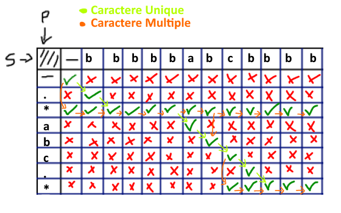

# 10. Regular Expression Matching

## Énoncé

Étant donné une chaîne d'entrée `s` et un modèle `p`, implémentez la correspondance d'expression régulière avec la prise en charge de `'.'` et `'*'` où :

- `'.'` Correspond à n'importe quel caractère.​​​​
- `'*'` Correspond à zéro ou plusieurs éléments précédents.

La correspondance doit couvrir la chaîne d'entrée **entière** (et non partielle).

## Exemple

**Exemple 1:**  
**Input:** s = "aa", p = "a"  
**Output:** false  
**Explication:** "a" ne correspond pas à la chaîne entière "aa".

**Exemple 2:**  
**Input:** s = "aa", p = "a*"  
**Output:** true  
**Explication:** `*` signifie zéro ou plusieurs des éléments précédents, 'a'.

**Exemple 2:**  
**Input:** s = "ab", p = "._"  
**Output:** true  
**Explication:** `._` signifie zéro ou plus de n'importe quel caractère.

## Contraintes

`1 <= s.length <= 20`  
`1 <= p.length <= 20`  
`s` contient uniquement des lettres anglaises minuscules.  
`p` contient uniquement des lettres anglaises minuscules, `'.'`, et `'*'`.  
Il est garanti qu'à chaque apparition du caractère ``*'`, il y aura un précédent caractère valide auquel correspondre.

## Note personnelle

Date: 11-03-2024

J'ai opté pour une approche récursive pour résoudre ce problème, mais je dois admettre que mon code est extrêmement désorganisé en raison de mon manque de compétence. Je suis pleinement conscient que sa complexité temporelle et spatiale est de `O(2^n)` dans le pire des cas, ce qui est considérable pour ce type de problème.

Les contraintes généreuses permettent à mon code de ne pas **Time Out**, au vu de la longueur maximale du pattern et de la chaine d'entrée.

Mon code ressemble à un "Spaghetti code", ce qui rend difficile sa description. Pour le rédiger, j'ai progressé petit à petit en me confrontant à des données d'entrée qui ne donnaient pas le résultat escompté, puis en corrigeant au fur et à mesure jusqu'à obtenir une solution qui réussit tous les jeux de tests.

J'ai également apporté plusieurs optimisations, passant de la première version qui prenait 2250ms, à la seconde qui prenait 280ms, jusqu'à atteindre 0ms.

Cependant, j'ai remarqué des approches en `O(n^2)` utilisant la programmation dynamique. Je pense que je vais explorer ce concept à l'avenir car c'est un type d'approche que j'ai du mal à maîtriser, même si j'en comprends légèrement le principe.

Le code est trouvable [ici](v1.cpp)

UPDATE 20-03-2024

Après avoir exploré la programmation dynamique, j'ai développé une solution qui met en oeuvre ce concept.

L'idée est de créer une matrice 2D de booléens de taille `s.size() + 1` par `pattern.size() + 1`. Chaque cellule de cette matrice a pour valeur true si la sous-chaîne de `s` de 0 jusqu'au caractère `i - 1` correspond au `pattern` de `0` jusqu'à `j - 1`.

Il y a deux cas à prendre en compte : lorsque le caractère actuel est unique (pas une étoile) ou lorsque le caractère est une étoile (\*).

Dans le cas d'un caractère unique, nous devons vérifier si la chaîne correspondante au caractère précédent. Pour ce faire, nous pouvons récupérer cette valeur déjà calculée avec `dp[i - 1][j - 1]`, puis nous vérifions si le caractère actuel du motif correspond au caractère dans `s`.

Dans le cas d'un caractère multiple (`*`), c'est légèrement plus compliqué:

- Si le caractère apparaît 0 fois, nous devons vérifier `dp[i][j - 2]`, car `j-2` représente le dernier caractère avant le motif multiple.
- Sinon, il faut vérifier si la chaîne correspondante au caractère précédent. Pour ce faire, nous pouvons récupérer cette valeur déjà calculée avec `dp[i - 1][j]`, puis nous vérifions si le caractère actuel du motif correspond au caractère dans `s`

Voici une représentation de la matrice avec `s = "bbbbbabcbbbb"` et `pattern = .*abc.*`.  

Cette nouvelle approche permet de résoudre efficacement le problème avec une complexité temporelle et spatiale de `O(n * m)`.

