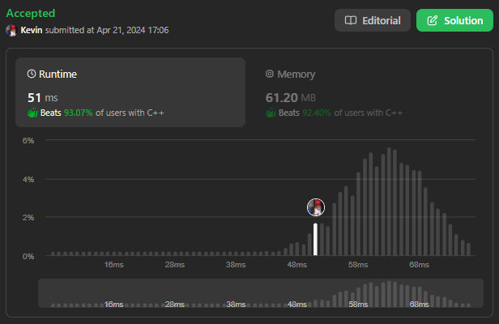

# 11. Container With Most Water

## Énoncé

Vous recevez un tableau d'entiers `height` de longueur `n`. Il y a `n` lignes verticales tracées de telle sorte que les deux extrémités de la `ième` ligne soient `(i, 0)` et `(i, height[i])`.

Trouvez deux lignes qui, avec l'axe des x, forment un conteneur, de sorte que le conteneur contienne le plus d'eau possible.

Renvoie la quantité maximale d’eau qu’un récipient peut stocker.

**Remarquez** que vous ne pouvez pas incliner le conteneur.

## Exemple

**Exemple 1:**


**Input:** height = [1,8,6,2,5,4,8,3,7]  
**Output:** 49  
**Explication:** Les lignes verticales ci-dessus sont représentées par le tableau [1,8,6,2,5,4,8,3,7]. Dans ce cas, la surface maximale d'eau (section bleue) que le conteneur peut contenir est de 49.

**Exemple 2:**  
**Input:** height = [1,1]  
**Output:** 1

## Contraintes

`n == height.length`  
`2 <= n <= 10^5`  
`0 <= height[i] <= 10^4`

## Note personnelle

L'approche initiale, qualifiée de "Naive", pour résoudre ce problème implique de tester de manière exhaustive toutes les solutions possibles.

```cpp
int maxArea(vector<int>& height) {
  int ans = 0;

  for(int left = 0; left < height.size(); left++){
    for(int right = left + 1; right < height.size(); right++){
      ans = max(ans, min(height[left], height[right]) * (right - left));
    }
  }

  return ans;
}
```

Cette méthode présente une complexité temporelle de `O(n ^ 2)` et une complexité spatiale de `O(1)`. En raison des contraintes de l'exercice, notamment la taille du tableau d'entrée, cette solution dépasse le temps imparti.

Une autre approche, dite "Greedy", permet de résoudre ce problème en parcourant les éléments du tableau une seule fois.

L'idée est d'utiliser deux pointeurs, `left` et `right` , initialement positionnés aux extrémités de `height`.

On itère tant que `right` est inférieur à `left`. À chaque itération, on calcule la quantité d'eau et on conserve la valeur maximale rencontrée. Ensuite, on met à jour les indices `right` et `left` de sorte a maximisé la quantité d'eau.

### Preuve par contradiction:

Supposons qu'il existe une solution optimale différente de celle produite par l'algorithme greedy.

Soient `h_opt_left` et `h_opt_right`, les hauteurs des barres dans la solution optimale.

À chaque étape, l'algorithme greedy choisit `h_left` et `h_right` de manière à maximiser la quantité d'eau entre eux.

Analyse des cas:

- Si `h_left < h_right`, alors `h_left` est la hauteur minimale et on déplace `left` vers la droite.
- Si `h_left > h_right`, alors `h_right` est la hauteur minimale et on déplace `right` vers la gauche.

Supposons que `h_opt_left < h_opt_right` et que `h_opt_right` a une position différente de `h_right` choisi par l'algorithme.

Cela implique qu'il existe une meilleure position pour `h_opt_right`, ce qui contredit le choix de l'algorithme greedy qui maximise toujours la quantité d'eau entre `h_left` et `h_right`.

Puisque la supposition d'une solution optimale différente de celle de l'algorithme greedy conduit à une contradiction, l'algorithme greedy est donc correct et produit la réponse optimale.

Cette approche a une complexité temporelle de `O(n)` et une complexité spatiale de `O(1)`.



