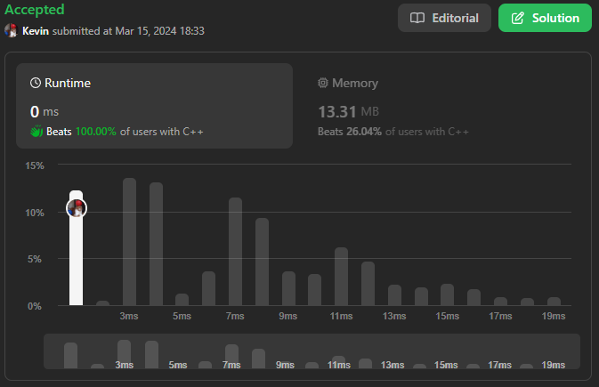
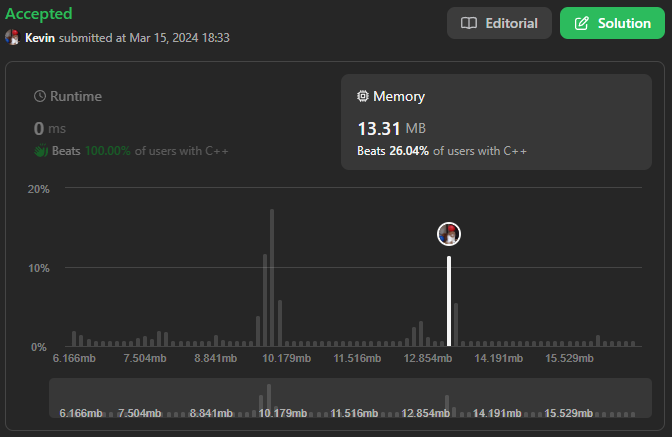

# 12. Integer to Roman

## Énoncé

Les chiffres romains sont représentés par sept symboles différents: `I`, `V`, `X`, `L`, `C`, `D` et `M`.

| **Symbol** | **Value** |
| ---------- | --------- |
| I          | 1         |
| V          | 5         |
| X          | 10        |
| L          | 50        |
| C          | 100       |
| D          | 500       |
| M          | 1000      |

Par exemple, `2` s'écrit `II` en chiffres romains, seulement deux uns additionnés. `12` s'écrit `XII`, qui est simplement `X + II`. Le nombre `27` s'écrit `XXVII`, qui est `XX + V + II`.

Les chiffres romains sont généralement écrits du plus grand au plus petit, de gauche à droite. Cependant, le chiffre romains pour quatre n'est pas `IIII`. Au lieu de cela, il s’écrit `IV`. Parce que le un est avant le cinq, nous le soustrayons, ce qui fait quatre. Le même principe s’applique au nombre neuf, qui s’écrit `IX`. Il existe six cas où la soustraction est utilisée:

- `I` peut être placé avant `V` (5) et `X` (10) pour faire 4 et 9.
- `X` peut être placé avant `L` (50) et `C` (100) pour faire 40 et 90.
- `C` peut être placé avant `D` (500) et `M` (1000) pour faire 400 et 900.

Étant donné un entier, convertissez-le en chiffre romain.

## Exemple

**Exemple 1:**  
**Input:** num = 3  
**Output:** "III"  
**Explication:** 3 is represented as 3 ones.

**Exemple 2:**  
**Input:** num = 58  
**Output:** "LVIII"  
**Explication:** L = 50, V = 5, III = 3.

**Exemple 3:**  
**Input:** num = 1994  
**Output:** "MCMXCIV"  
**Explication:** M = 1000, CM = 900, XC = 90 and IV = 4.

## Contraintes

`1 <= num <= 3999`

## Note personnelle

Mon approche repose sur l'utilisation d'un tableau nommé `romanConverter`, qui stocke des paires **pair&lt;int, string&gt;**

Chaque paire représente une valeur numérique et sa conversion en chiffres romains. Pour simplifier la logique, j'ai inclus les valeurs intermédiaires telles que `4 --> IV`, `9 --> IX`, ect.

Je commence par initialiser ma valeur de sortie et un `index` à 0. Cet `index` est utilisé pour parcourir le tableau de paires.

Je boucle tant que `num` est différent de zéro. À chaque itération, je vérifie si `num` est supérieur ou égal à `romanConverter[index].first` :

- Si c'est le cas, je soustrais de `num` la valeur `romanConverter[index].first`, puis j'ajoute `romanConverter[index].second` à l'`output` .
- Sinon, j'incrémente l'`index` de 1.

Cette approche présente une complexité temporelle et spatiale de `O(n)`.

