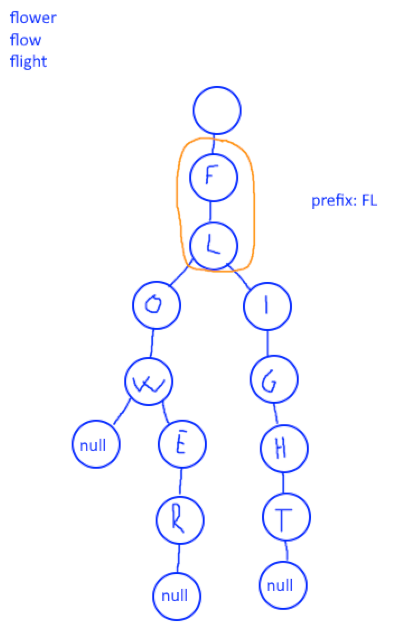

# 14. Longest Common Prefix

## Énoncé

Écrivez une fonction pour trouver la chaîne de préfixe commune la plus longue parmi un tableau de chaînes.

S'il n'y a pas de préfixe commun, renvoie une chaîne vide `""`.

## Exemple

**Exemple 1:**  
**Input:** strs = ["flower","flow","flight"]  
**Output:** "fl"

**Exemple 2:**  
**Input:** strs = ["dog","racecar","car"]  
**Output:** ""  
**Explication:** Il n'y a pas de préfixe commun parmi les chaînes d'entrée.

## Contraintes

`1 <= strs.length <= 200`  
`0 <= strs[i].length <= 200`  
`strs[i]` se compose uniquement de lettres anglaises minuscules.

## Note personnelle

Dans ma première approche de résolution de ce problème, j'ai opté pour une méthode consistant à initialiser le préfixe commun avec le premier élément de la liste. Ensuite, j'ai parcouru chaque élément de la liste pour trouver les caractères communs entre le préfixe et la chaîne en cours, puis j'ai retiré les différences du préfixe commun.

```cpp
string longestCommonPrefix(vector<string>& strs) {
  // Initialise le préfixe commun avec la première chaîne de caractères
  string commonPrefix = strs[0];

  // Parcours les chaînes de caractères à partir de la deuxième
  for(int i = 1; i < strs.size(); i++){
    // Récupère la référence à la chaîne de caractères actuelle
    string &s = strs[i];

    // Indicateur pour vérifier si les caractères sont les mêmes jusqu'à présent
    bool same = true;

    // Index pour parcourir les caractères des chaînes
    int j = 0;

    // Parcourt les caractères de la chaîne actuelle et du préfixe commun
    // jusqu'à ce qu'une différence soit trouvée ou que l'une des chaînes soit entièrement parcourue
    for(;j < s.size() && j < commonPrefix.size(); j++){
      if(s[j] != commonPrefix[j]){
        same = false;
        break;
      }
    }

    // Si une différence est trouvée, réduit le préfixe commun à la partie commune
    if(!same){
      commonPrefix = commonPrefix.substr(0, j);
    }
    // Si la chaîne actuelle est plus courte que le préfixe commun, met à jour le préfixe commun
    else if(commonPrefix.size() > s.size()){
      commonPrefix = s;
    }
  }

  // Retourne le préfixe commun trouvé
  return commonPrefix;
}
```

Cette approche présente une complexité temporelle de `O(n * m)`, où `n` est la longueur de `strs` et `m` est la longueur du préfixe commun. La complexité spatiale est de `O(m)`.

Cependant, une autre approche peut éviter l'utilisation de la fonction `substr`, ce qui la rendrait potentiellement plus efficace que celle proposée.

L'idée est d'initialiser le préfixe commun vide, et de parcourir par "colonne", c'est-à-dire que l'on va vérifier le premier caractère de chaque chaîne, puis passer au second, etc. jusqu'à trouver une différence.

Cette approche a la même complexité temporelle et spatiale que la précédente mais permet de se passer de la méthode substring.

Enfin, j'ai implémenté une dernière approche davantage par défi, notamment après avoir remarqué l'utilisation du tag "Trie". J'ai donc exploré cette structure et l'ai utilisée pour résoudre le problème. L'idée est de créer un arbre de préfixes, où la racine représente une chaîne vide. Pour chaque chaîne insérée dans l'arbre, on parcourt chaque caractère et on cherche le noeud correspondant ; s'il n'existe pas, on le crée. Ensuite, le préfixe commun est la concaténation de tous les noeuds qui n'ont qu'un enfant, en partant de la racine.



```cpp
// Structure de noeud pour représenter un noeud dans le trie
struct Node {
  unordered_map<char, Node*> child;
};

// Classe Trie pour représenter une structure de données trie
class Trie {
private:
  unordered_map<char, Node*> root; // Le noeud racine du trie

public:
  Trie() = default;

  // Méthode pour insérer une chaîne dans le trie
  void insert(string s) {
    unordered_map<char, Node*>* currentMap = &root;

    // Parcourt la chaîne caractère par caractère
    for (int i = 0; i < s.size(); i++) {
      // Si le caractère courant n'est pas dans le trie, l'ajouter
      if (currentMap->find(s[i]) == currentMap->end()) {
        currentMap->insert(make_pair(s[i], new Node()));
      }
      // Aller au noeud enfant correspondant au caractère courant
      currentMap = &currentMap->at(s[i])->child;
    }
    // Marque la fin de la chaîne en ajoutant un caractère spécial
    currentMap->insert(make_pair('0', new Node()));
  }

  // Méthode pour trouver le plus long préfixe commun dans le trie
  string findPrefix() {
    string output = "";
    unordered_map<char, Node*>& currentMap = root;

    // Tant que le noeud actuel a exactement un enfant
    while (currentMap.size() == 1) {
      auto it = currentMap.begin();
      // Si l'enfant est le marqueur de fin de chaîne, sortir de la boucle
      if (it->first == '0') {
        break;
      }
      // Ajoute le caractère à la sortie et passe au noeud enfant
      output += it->first;
      currentMap = it->second->child;
    }

    // Retourne le plus long préfixe commun trouvé
    return output;
  }
};

class Solution {
public:
  string longestCommonPrefix(vector<string>& strs) {
    Trie t = Trie();

    // Insérer chaque chaîne dans le trie
    for (string s : strs) {
      t.insert(s);
    }

    // Trouver et retourner le préfixe commun à partir du trie
    return t.findPrefix();
  }
};
```

Cette approche présente une complexité temporelle de `O(n * l)`, où `n` est la longueur de la liste et `l` la longueur de la plus grande chaîne. La complexité spatiale est de `O(n)`.


