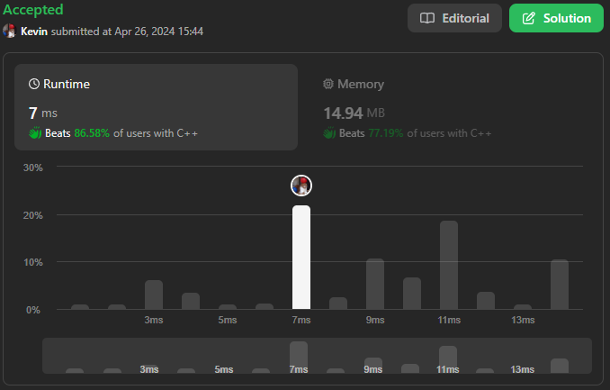

# 25. Reverse Nodes in k-Group

## Énoncé

Étant donné la `head` d'une liste chaînée, inversez les nœuds de la liste par groupes de `k` à la fois, et renvoyez la liste modifiée.

`k` est un entier positif et est inférieur ou égal à la longueur de la liste chaînée. Si le nombre de nœuds n'est pas un multiple de `k` alors les nœuds restants à la fin doivent rester tels quels.

Vous ne pouvez pas modifier les valeurs des nœuds de la liste, seuls les nœuds eux-mêmes peuvent être modifiés.

Pouvez-vous résoudre le problème avec une complexité spatiale de `O(1)` ?

## Exemple

**Exemple 1:**


**Input:** head = [1,2,3,4,5], k = 2  
**Output:** [2,1,4,3,5]

**Exemple 2:**


**Input:** head = [1,2,3,4,5], k = 3  
**Output:** [3,2,1,4,5]

## Contraintes

Le nombre de nœuds dans la liste est `n`.  
`1 <= k <= n <= 5000`  
`0 <= Node.val <= 1000`

## Note personnelle

Dans ma première approche, j'ai choisi de représenter la liste chaînée sous forme de tableau, divisé en groupes. Cependant, il s'agit clairement d'un algorithme non optimal qui ne tire pas parti des propriétés intrinsèques des listes chaînées.

```cpp
ListNode* reverseKGroup(ListNode* head, int k) {
  vector<vector<ListNode*>> groups;
  vector<ListNode*> currentGroup;

  //Créer les groupes
  while(head){
    if(currentGroup.size() == k){
      groups.push_back(currentGroup);
      currentGroup = {};
    }
    currentGroup.push_back(head);
    head = head->next;
  }
  if(currentGroup.size() == k){
    groups.push_back(currentGroup);
    currentGroup = {};
  }

  //Inverser les groupes
  for(vector<ListNode*> group: groups){
    for(int i = 1; i < group.size(); i++){
      group[i]->next = group[i - 1];
    }
  }

  //Lier les groupes
  for(int i = 0; i < groups.size() - 1; i++){
    groups[i][0]->next = groups[i + 1][groups[i + 1].size() - 1];
  }


  if(currentGroup.size() > 0){
    groups[groups.size() - 1][0]->next = currentGroup[0];
  }
  else{
    groups[groups.size() - 1][0]->next = nullptr;
  }

  return groups[0][groups[0].size() - 1];
}
```

Cette approche a une complexité temporelle et spatiale de `O(n)`, où `n` représente le nombre d'éléments dans la liste.

Pour ma seconde approche, j'ai décidé d'exploiter au mieux les caractéristiques des listes chaînées. J'ai mis en place une boucle principale qui tourne tant que la liste n'est pas vide. À chaque itération, je récupère un groupe de `k` éléments, les inverse et réaffecte les pointeurs de fin.

Cette approche présente une complexité temporelle de `O(n)` et une complexité spatiale de `O(1)`.



