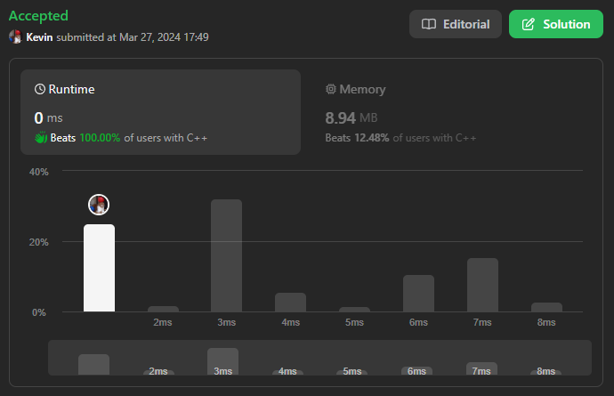

# 32. Longest Valid Parentheses

## Énoncé

Étant donné une chaîne contenant uniquement les caractères `'('` et `')'`, renvoie la longueur de la sous-chaîne de parenthèses valides (bien formées) la plus longue.

## Exemple

**Exemple 1:**  
**Input:** s = "(()"  
**Output:** 2  
**Explication:** La sous-chaîne de parenthèses valide la plus longue est "()".

**Exemple 2:**  
**Input:** s = ")()())"  
**Output:** 4  
**Explication:** La sous-chaîne de parenthèses valide la plus longue est "()()".

**Exemple 3:**  
**Input:** s = ""  
**Output:** 0

## Contraintes

`0 <= s.length <= 3 * 10^4`  
`s[i]` est `'('`, ou `')'`.

## Note personnelle

Ma méthode repose sur l'utilisation d'une pile pour suivre les indices des éléments ouverts. De plus, elle exploite un vecteur `dp` de taille `s.size()`, où `dp[i]` présente la longueur de la sous-séquence valide se terminant à `s[i]`. Je maintiens également la longueur maximale trouvée jusqu'à présent grâce à la variable `best`.

Je parcours chaque caractère de `s`, et si `s[i]` est une parenthèse ouvrante, j'ajoute `i` à la pile.

En revanche, si `s[i]` est une parenthèse fermée, je vérifie si la pile n'est pas vide. Dans ce cas, je calcule la longueur de la séquence que je stocke dans une variable appelée `value`, cette longueur étant calculée par la formule `i - stack.top() + 1`.

Cette approche décrite précédemment gère toutes les parenthèses imbriquées (par exemple, "(())" a une longueur de 4).

Pour prendre en charge les parenthèses non imbriquées, j'utilise le tableau `dp` (par exemple, "()(())", sans le tableau `dp` aurait une longueur de 4, alors que sa longueur est 6).

Pour cela, je vérifie si `value-i >= 0`, et si c'est le cas, j'ajoute `dp[i - value]` à `value`.

Je mets à jour `best` si `value` est plus grand que le `best` actuel.

Cette approche présente une complexité temporelle et spatiale de `O(n)`.

