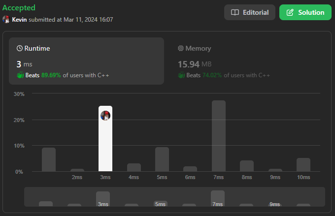
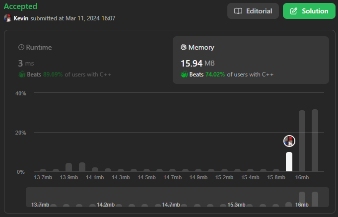

# 34. Find First and Last Position of Element in Sorted Array

## Énoncé

Étant donné un tableau d'entiers `nums` triés par **ordre croissant**, trouvez la position de début et de fin d'une valeur `target`.

Si `target` n'est pas trouvé dans le tableau, renvoyez `[-1, -1]`.

Vous devez écrire un algorithme avec une complexité temporelle de `O(log n)`.

## Exemple

**Exemple 1:**  
**Input:** nums = [5,7,7,8,8,10], target = 8  
**Output:** [3,4]

**Exemple 2:**  
**Input:** nums = [5,7,7,8,8,10], target = 6  
**Output:** [-1,-1]

**Exemple 3:**  
**Input:** nums = [], target = 0  
**Output:** [-1,-1]

## Contraintes

`0 <= nums.length <= 10^5`  
`-10^9 <= nums[i] <= 10^9`  
`nums` est un tableau croissant.  
`-10^9 <= target <= 10^9`

## Note personnelle

Une approche naïve à ce problème consisterait à parcourir `nums` jusqu'à trouver `target` , puis à continuer jusqu'à ne plus le trouver.

L'implémentation de cette approche ressemblerait à ceci:

```cpp
vector<int> searchRange(vector<int>& nums, int target) {
  int start = -1; // Déclaration et initialisation de l'indice de début de plage
  int end = -1;   // Déclaration et initialisation de l'indice de fin de plage

  // Parcours du vecteur
  for(int i = 0; i < nums.size(); i++){
    // Si l'élément courant est égal à la cible et c'est la première occurrence
    if(nums[i] == target && start == -1){
      start = i; // Mise à jour de l'indice de début de plage
      end = i;   // Mise à jour de l'indice de fin de plage
      break;     // Sortie de la boucle, car on a trouvé la première occurrence
    }
  }

  // Si aucun élément correspondant n'a été trouvé, retourner {-1, -1} (pas de plage)
  if(start == -1){
    return {-1, -1};
  }

  // Recherche de la fin de la plage
  while(end < nums.size() && nums[end] == target){
    end++; // Incrémentation de l'indice de fin de plage tant qu'on trouve la cible
  }
  end--; // Décrémentation de 1 pour obtenir l'indice correct de fin de plage

  // Retourner la plage d'indices trouvée
  return {start, end};
}
```

Cette approche a une complexité temporelle de `O(n)` et une complexité spatiale de `O(1)`, elle ne répond pas aux exigences de l'énoncé.

La seconde approche utiliserait le fait que notre tableau d'entrée est trié grâce à l'utilisation d'une recherche binaire. En changeant légèrement les conditions en fonction de si l'on cherche le début ou la fin de la plage, on peut parvenir au résultat souhaité.

Détail des subtilités de la recherche binaire pour trouver le premier ou dernier élément de notre cible (`mid` représente l'indice médian de la plage):

- Si l'on cherche la première occurrence de `target`, et que `nums[mid] >= target`, alors notre valeur se trouve dans la partie gauche de la plage.
- Si l'on cherche la dernière occurrence de `target`, et que `nums[mid] > target`, alors notre valeur se trouve dans la partie gauche de la plage.
- Si les conditions précédentes ne sont pas remplies, notre valeur se trouve dans la partie droite de la plage.

Il n'y a pas d'arrêt prématuré de la boucle, seulement quand l'indice de début de la plage est supérieur à l'indice de fin.

Cette approche a une complexité temporelle de `O(log n)` et une complexité spatiale de `O(1)`.



