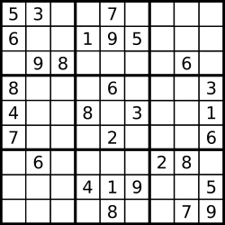

# 36. Valid Sudoku

## Énoncé

Déterminez si un tableau de Sudoku `9 x 9` est valide. Seules les cellules remplies doivent être validées **selon les règles suivantes**:

- Chaque ligne doit contenir les chiffres `1-9` sans répétition.
- Chaque colonne doit contenir les chiffres `1-9` sans répétition.
- Chacune des neuf sous-grilles `3 x 3` de la grille doit contenir les chiffres de `1-9` sans répétition.

**Note**: Un tableau de Sudoku (partiellement rempli) peut être valide mais n'est pas nécessairement résoluble.

## Exemple

**Exemple 1:**  


**Input:**

```
board =
[
  ["5","3",".",".","7",".",".",".","."],
  ["6",".",".","1","9","5",".",".","."],
  [".","9","8",".",".",".",".","6","."],
  ["8",".",".",".","6",".",".",".","3"],
  ["4",".",".","8",".","3",".",".","1"],
  ["7",".",".",".","2",".",".",".","6"],
  [".","6",".",".",".",".","2","8","."],
  [".",".",".","4","1","9",".",".","5"],
  [".",".",".",".","8",".",".","7","9"]
]
```

**Output:** true

**Exemple 2:**  
**Input:**

```
board =
[
  ["8","3",".",".","7",".",".",".","."],
  ["6",".",".","1","9","5",".",".","."],
  [".","9","8",".",".",".",".","6","."],
  ["8",".",".",".","6",".",".",".","3"],
  ["4",".",".","8",".","3",".",".","1"],
  ["7",".",".",".","2",".",".",".","6"],
  [".","6",".",".",".",".","2","8","."],
  [".",".",".","4","1","9",".",".","5"],
  [".",".",".",".","8",".",".","7","9"]
]
```

**Output:** false  
**Explication:** Identique à l'exemple 1, sauf que le 5 dans le coin supérieur gauche est modifié en 8. Puisqu'il y a deux 8 dans la sous-case 3x3 en haut à gauche, il n'est pas valide.

## Contraintes

`board.length == 9`  
`board[i].length == 9`  
`board[i][j]` est un chiffre `1-9` ou `'.'`.

## Note personnelle

L'approche adoptée consiste à examiner chaque case de la grille et à marquer les éléments déjà rencontrés dans une ligne, une colonne ou une sous-grille.

Pour cela, j'ai mis en place un tableau tridimensionnel de taille 3x9x9 initialisé à false:

- Le premier indice définit le type : 0 pour une ligne, 1 pour une colonne et 2 pour une sous-grille.
- Le deuxième indice définit l'index de cette ligne, colonne ou sous-grille.
- Le troisième indice définit le chiffre rencontré.

Cette méthode présente une complexité temporelle et spatiale de `O(1)` grâce aux tailles fixes de la grille. Cependant, si l'on envisageait des tailles différentes, la complexité temporelle et spatiale serait de `O(n^2)`.


