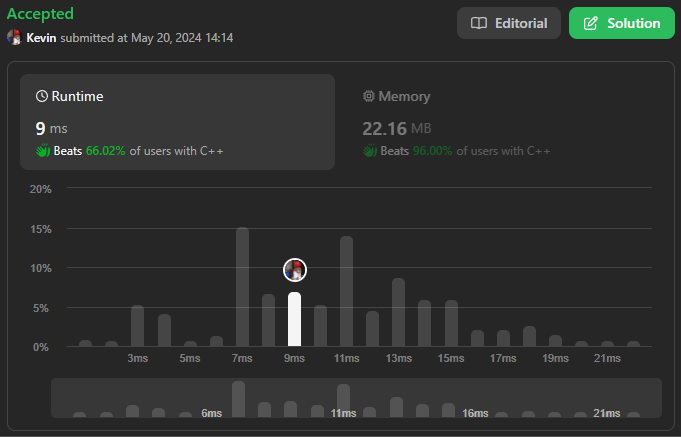

# 42. Trapping Rain Water

## Énoncé

Étant donné `n` nombres entiers non négatifs représentant une carte d'élévation où la largeur de chaque barre est de `1`, calculez la quantité d'eau qu'elle peut piéger après la pluie.

## Exemple

**Exemple 1:**


**Input:** height = [0,1,0,2,1,0,1,3,2,1,2,1]  
**Output:** 6  
**Explication:** La carte d'élévation ci-dessus (section noire) est représentée par le tableau [0,1,0,2,1,0,1,3,2,1,2,1]. Dans ce cas, 6 unités d’eau de pluie (partie bleue) sont piégées.

**Exemple 2:**  
**Input:** height = [4,2,0,3,2,5]  
**Output:** 9

## Contraintes

`n == height.length`  
`1 <= n <= 2 * 10^4`  
`0 <= height[i] <= 10^5`

## Note personnelle

Pour résoudre cet exercice, j'ai choisi d'utiliser la technique des deux pointeurs.

L'idée est de parcourir l'intégralité du tableau à l'aide de deux pointeurs, `left` et `right`, partant respectivement des extrémités gauche et droite. Pendant ce parcours, nous maintenons la hauteur maximale rencontrée de chaque côté.

Une variable `ans`, initialisée à `0`, permet de stocker la quantité d'eau piégée.

Un vecteur de taille `n` est utilisé pour stocker la hauteur maximale rencontrée lors du premier passage sur chaque case.

La quantité d'eau est calculée lors du second passage sur une case visitée. Selon que ce second passage soit effectué par le pointeur `left` ou `right`, on récupère la plus petite valeur entre `maxLeft` (ou `maxRight`) et la valeur stockée dans le vecteur. On calcule ensuite la différence entre cette valeur minimale et `height[i]`.

```cpp
int trap(vector<int>& height) {
  // Vecteur pour stocker les hauteurs maximales rencontrées jusqu'à chaque position
  vector<int> v(height.size(), -1);

  // Pointeurs pour les positions gauche et droite dans le vecteur height
  int left = 0;
  int right = height.size() - 1;

  // Variables pour stocker les hauteurs maximales à gauche et à droite
  int maxLeft = 0;
  int maxRight = 0;

  // Variable pour stocker la quantité totale d'eau piégée
  int ans = 0;

  // Boucle pour parcourir le vecteur height de gauche à droite
  while(left < height.size()) {
    // Mise à jour des hauteurs maximales à gauche et à droite
    maxLeft = max(maxLeft, height[left]);
    maxRight = max(maxRight, height[right]);

    // Calcul de l'eau piégée à la position 'left' si elle a été visitée auparavant
    if(v[left] != -1) {
      int ansLeft = min(v[left], maxLeft);
      ans += ansLeft - height[left];
    } else {
      v[left] = maxLeft;
    }

    // Calcul de l'eau piégée à la position 'right' si elle a été visitée auparavant
    if(v[right] != -1) {
      int ansRight = min(v[right], maxRight);
      ans += ansRight - height[right];
    } else {
      v[right] = maxRight;
    }

    // Avancer le pointeur gauche et reculer le pointeur droit
    left++;
    right--;
  }

  // Retourner la quantité totale d'eau piégée
  return ans;
}
```

Cette approche présente une complexité temporelle et spatiale de `O(n)`.

Une autre approche utilisant également le principe des deux pointeurs garde une trace des hauteurs maximales à gauche et à droite, mais le parcours est différent.

Ici, nous parcourons tant que `left` est inférieur ou égal à `right`. À chaque itération, nous mettons à jour les variables `maxLeft` et `maxRight`. Ensuite, selon la plus petite valeur entre `maxLeft` et `maxRight`, nous calculons la quantité d'eau pour ce côté et avançons l'index correspondant.

La complexité temporelle de cette approche est de `O(n)` et la complexité spatiale est de `O(1)`.



