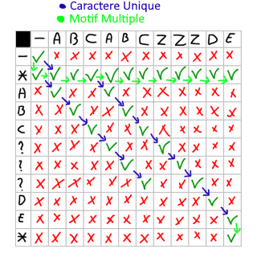

# 44. Wildcard Matching

## Énoncé

Étant donné une chaîne d'entrée (`s`) et un motif (`p`), mettez en œuvre la correspondance de motif générique avec prise en charge de `'?'` et `'*'` où:

- `'?'` Correspond à n'importe quel caractère unique.
- `'*'` Correspond à n'importe quelle séquence de caractères (y compris la séquence vide).

La correspondance doit couvrir **toute** la chaîne d'entrée (pas seulement une partie).

## Exemple

**Exemple 1:**  
**Input:** s = `"aa"`, p = `"a"`  
**Output:** false  
**Explication:** `"a"` ne correspond pas à la chaîne entière `"aa"`.

**Exemple 2:**  
**Input:** s = `"aa"`, p = `"*"`  
**Output:** true  
**Explication:** `'*'` correspond à n’importe quelle séquence.

**Exemple 3:**  
**Input:** s = `"cb"`, p = `"?a"`  
**Output:** false  
**Explication:** `'?'` correspond à `'c'`, mais la deuxième lettre est `'a'`, qui ne correspond pas à `'b'`.

## Contraintes

`0 <= s.length, p.length <= 2000`  
`s` contient uniquement des lettres anglaises minuscules.  
`p` contient uniquement des lettres anglaises minuscules, `'?'` ou `'*'`.

## Note personnelle

Ce problème rappelle beaucoup celui de la correspondance d'expressions régulières [10. Regular Expression Matching](../0010.%20Regular%20Expression%20Matching/), à l'exception de quelques règles qui diffèrent légèrement.

Je l'ai donc abordé en utilisant la programmation dynamique.

L'idée consiste à créer une matrice 2D de booléens de taille `p.size() + 1` par `s.size() + 1`. Chaque cellule de cette matrice a pour valeur true si la sous-chaîne de `s` allant de 0 jusqu'au caractère `j - 1` correspond à `p` de `0` jusqu'à `i - 1`.

Deux cas doivent être pris en compte : lorsque le caractère actuel est unique (pas une étoile) ou lorsqu'il s'agit d'une séquence de caractères quelconque (\*).

Dans le cas d'un caractère unique, on vérifie si le caractère du motif correspond au caractère de la chaîne. Si c'est le cas et que le motif précédant correspond à la chaîne précédant (c'est-à-dire sans le caractère du motif et de la chaîne que l'on traite actuellement), alors la chaîne et le motif correspondent jusqu'à ce dernier caractère. Pour savoir si la chaîne précédente correspond au motif précédent, j'utilise `dp[i - 1][j - 1]`.

Dans le cas d'une séquence de caractères quelconque, il y a deux autres cas à considérer : ignorer le motif multiple ou le prendre en compte.

- Pour ignorer le motif multiple, on vérifie simplement `dp[i - 1][j]`, ce qui signifie que la chaîne sans le caractère actuel du motif correspond.
- Pour prendre en compte le motif multiple, on vérifie simplement `dp[i][j - 1]`, ce qui signifie que le motif multiple est composé de `s[j]`

En appliquant ce principe à chaque case de la matrice, on peut déterminer si une chaîne `s` correspond à un motif `p` en vérifiant la dernière case `dp[p.size()][s.size()]`.

Voici une représentation de la matrice résultante pour `s = "abcabczzzde"` et `p = "*abc???de*"`:

Cette approche présente une complexité temporelle et spatiale de `O(n * m)`.

Il est également possible d'améliorer la complexité spatiale de cette approche. Comme on peut le remarquer, on utilise soit la ligne actuelle soit la ligne précédente de la matrice pour effectuer les calculs. Ainsi, on peut réduire la complexité spatiale à `O(2m)`.

