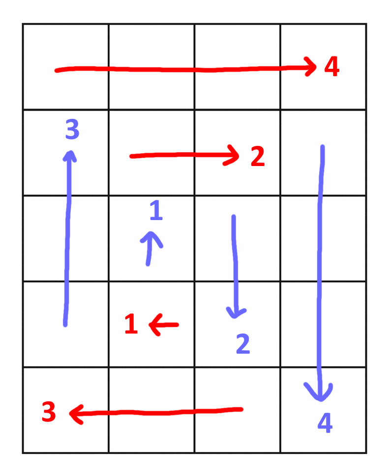
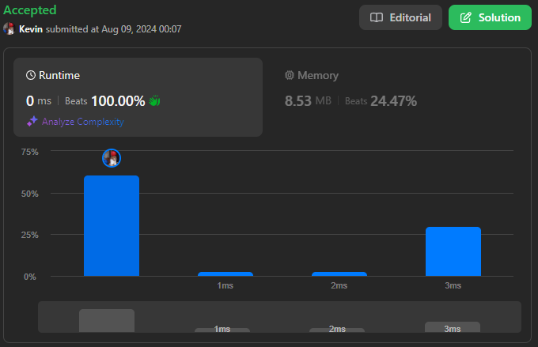
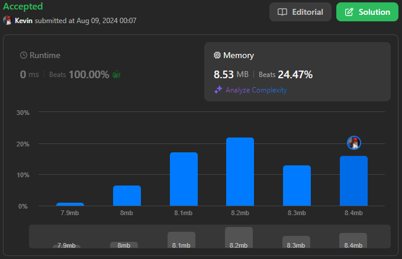

# 54. Spiral Matrix

## Énoncé

Étant donné une matrice de dimensions `m x n`, renvoyez tous les éléments de `matrix` dans un ordre en spirale.

## Exemple

**Exemple 1:**


**Input:** matrix = [[1,2,3],[4,5,6],[7,8,9]]  
**Output:** [1,2,3,6,9,8,7,4,5]

**Exemple 2:**


**Input:** matrix = [[1,2,3,4],[5,6,7,8],[9,10,11,12]]  
**Output:** [1,2,3,4,8,12,11,10,9,5,6,7]

## Contraintes

`m == matrix.length`  
`n == matrix[i].length`  
`1 <= m, n <= 10`  
`-100 <= matrix[i][j] <= 100`

## Note personnelle

Pour mieux illustrer l'explication, référez-vous à l'image suivante:



Cette image montre le chemin parcouru à travers la matrice, où chaque nombre indique le nombre de cases traversées dans une direction donnée avant de changer de direction.

On observe que, quel que soit le sens du déplacement, à chaque changement de direction, le prochain mouvement dans le même axe (horizontal ou vertical) se fera avec une case en moins.

J'ai donc conçu un algorithme qui exploite cette caractéristique pour générer un parcours en spirale dans la matrice.

```cpp
// Définition des directions pour le mouvement dans la matrice : droite, bas, gauche, haut.
vector<vector<int>> dir = {{0, 1}, {1, 0}, {0, -1}, {-1, 0}};

vector<int> spiralOrder(vector<vector<int>>& matrix) {
  // Calcul du nombre total d'éléments dans la matrice
  int size = matrix[0].size() * matrix.size();

  // Vecteur pour stocker l'ordre spirale des éléments
  vector<int> ans;

  // Nombre de lignes et de colonnes restantes à parcourir
  int rows = matrix.size() - 1;
  int cols = matrix[0].size();

  // Initialisation des coordonnées pour le parcours de la matrice
  int i = 0;
  int j = -1;

  // Indicateur de la direction actuelle (0: droite, 1: bas, 2: gauche, 3: haut)
  int d = 0;

  // Boucle jusqu'à ce que tous les éléments soient ajoutés à la liste `ans`
  while(ans.size() < size){
    // Calcul de la direction actuelle
    int currD = d % 4;

    // Détermination du nombre d'étapes à effectuer dans la direction actuelle
    int end = (currD == 0 || currD == 2 ? cols-- : rows--);

    // Parcours dans la direction actuelle
    for(int b = 0; b < end; b++){
      i += dir[currD][0]; // Mise à jour de la position verticale
      j += dir[currD][1]; // Mise à jour de la position horizontale

      // Ajout de l'élément courant à la liste des résultats
      ans.push_back(matrix[i][j]);
    }

    // Passage à la direction suivante
    d++;
  }

  // Retourne l'ordre spirale des éléments
  return ans;
}
```

- Complexité Temporelle: `O(n * m)`
- Complexité Spatiale: `O(n * m)`



