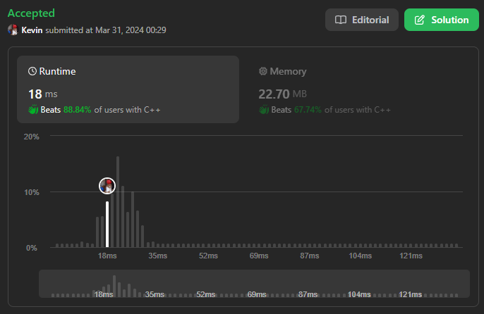
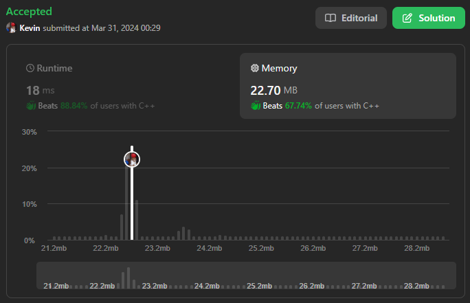

# 56. Merge Intervals

## Énoncé

Étant donné un tableau d'`intervals` où `intervals[i] = [starti, endi]`, fusionnez tous les intervalles qui se chevauchent et renvoient un tableau des intervalles qui ne se chevauchent pas qui couvrent tous les intervalles de l'entrée.

## Exemple

**Exemple 1:**  
**Input:** intervals = [[1,3],[2,6],[8,10],[15,18]]  
**Output:** [[1,6],[8,10],[15,18]]  
**Explication:** [1,3] et [2,6] se chevauchent, le résultat de leurs fusions est [1,6].

**Exemple 2:**  
**Input:** intervals = [[1,4],[4,5]]  
**Output:** [[1,5]]  
**Explication:** [1,4] et [4,5] se chevauchent, le résultat de leurs fusions est [1,5].

## Contraintes

`1 <= intervals.length <= 10^4`  
`intervals[i].length == 2`  
`0 <= starti <= endi <= 10^4`

## Note personnelle

Pour résoudre ce problème, j'ai choisi une approche qui implique le tri de la liste d'intervalles selon l'ordre croissant des valeurs de `starti`.

Ensuite, je parcours ces intervalles en maintenant un intervalle temporaire. Tant que l'intervalle courant se trouve dans notre intervalle temporaire, nous le mettons à jour. Si l'intervalle courant ne chevauche pas l'intervalle temporaire, nous ajoutons l'intervalle temporaire au vecteur de sortie.

Cette méthode présente une complexité temporelle de `O(n log n)`, principalement due au tri, où `n` est le nombre d'intervalles, et une complexité spatiale de `O(n)`.

