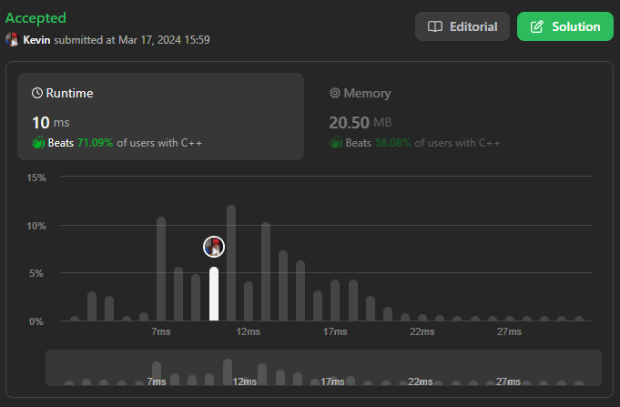
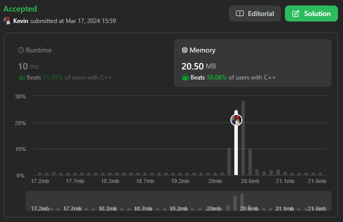

# 57. Insert Interval

## Énoncé

Vous disposez d'un tableau d'intervalles non chevauchants `intervals` où `intervals[i] = [starti, endi]` représente le début et la fin du `ième` intervalle, `intervals` est trié dans l'ordre croissant par `starti`. Vous disposez également d'un intervalle `newInterval = [start, end]` qui représente le début et la fin d'un autre intervalle.

Insérez `newInterval` dans `intervals` de sorte que `intervals` soit toujours trié dans l'ordre croissant par `starti` et que `intervals` n'ait toujours aucun intervalle qui se chevauche (fusionnez les intervalles chevauchants si nécessaire).

Retournez `intervals` après l'insertion.

**Note:** Vous n'avez pas besoin de modifier `intervals`, vous pouvez créer un nouveau tableau et le retourner.

## Exemple

**Exemple 1:**  
**Input:** intervals = [[1,3],[6,9]], newInterval = [2,5]  
**Output:** [[1,5],[6,9]]

**Exemple 2:**  
**Input:** intervals = [[1,2],[3,5],[6,7],[8,10],[12,16]], newInterval = [4,8]  
**Output:** [[1,2],[3,10],[12,16]]  
**Explication:** Parce que le nouvel intervalle [4,8] chevauche [3,5],[6,7],[8,10].

## Contraintes

`0 <= intervals.length <= 10^4`  
`intervals[i].length == 2`  
`0 <= starti <= endi <= 10^5`  
`intervals` est trié par `starti` par ordre **croissant**.  
`newInterval.length == 2`  
`0 <= start <= end <= 10^5`

## Note personnelle

Mon approche utilise trois boucles principales, chacune étant détaillée ci-dessous. Nous initialisons un tableau appelé `ans` pour stocker les valeurs de retour.

La première boucle vise à trouver le premier intervalle de la liste où la fin est inférieure au début du nouvel intervalle. À chaque itération, nous ajoutons l'intervalle actuel au tableau `ans`. L'objectif de cette boucle est d'identifier où insérer notre intervalle.

Si, à la fin de cette boucle, nous avons parcouru toute la liste d'intervalles sans trouver un emplacement approprié, cela signifie que l'intervalle doit être inséré à la fin.

Ensuite, nous initialisons deux variables:

- `startInterval` qui représente le début de l'intervalle à insérer. Elle est initialisée avec la valeur minimale entre le début du nouvel intervalle et le début de l'intervalle actuel.
- `endInterval` qui représente la fin de l'intervalle à insérer. Elle est initialisée avec la valeur de fin du nouvel intervalle.

La deuxième boucle est chargée de trouver les intervalles qui chevauchent celui à insérer. Pendant chaque itération, nous mettons à jour la fin de l'intervalle avec la valeur maximale entre `endInterval` et la fin de l'intervalle actuel. À la fin de cette boucle, nous insérons le nouvel intervalle trouvé.

Enfin, la dernière boucle sert à ajouter les éléments manquants dans notre tableau de sortie.

Cette approche présente une complexité temporelle et spatiale de `O(n)`.

