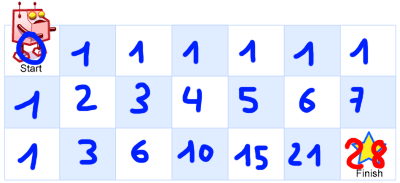

# 62. Unique Paths

## Énoncé

Il y a un robot sur une grille `m x n`. Le robot est initialement situé dans le **coin supérieur gauche** (c'est-à-dire `grid[0][0]`). Le robot essaie de se déplacer vers le **coin inférieur droit** (c'est-à-dire `grid[m - 1][n - 1]`). Le robot ne peut se déplacer que vers le bas ou vers la droite à tout moment.

Étant donné les deux entiers `m` et `n`, renvoie le nombre de chemins uniques possibles que le robot peut emprunter pour atteindre le coin inférieur droit.

Les test cases sont générés de manière à ce que la réponse soit inférieure ou égale à `2 * 10^9`.

## Exemple

**Exemple 1:**  


**Input:** m = 3, n = 7  
**Output:** 28

**Exemple 2:**  
**Input:** m = 3, n = 2  
**Output:** 3

## Contraintes

`1 <= m, n <= 100`

## Note personnelle

Dans mon approche, j'ai utilisé la programmation dynamique pour résoudre ce problème. L'idée principale est de calculer, pour chaque case d'un tableau 2D, le nombre de chemins uniques permettant d'atteindre cette case.

Étant donné que les déplacements sont uniquement permis vers la droite et vers le bas, j'initialise chaque case de la première ligne et de la première colonne avec la valeur 1, car il n'existe qu'un seul chemin pour atteindre chacune de ces cases. Pour les autres cases, leur valeur est déterminée en additionnant les valeurs des cases voisines situées à gauche et en haut.



```cpp
int uniquePaths(int m, int n) {
  // Déclaration d'un tableau 2D pour stocker les résultats intermédiaires
  int dp[m][n];

  // Initialisation de la première colonne
  for(int i = 0; i < m; i++){
    dp[i][0] = 1;
  }

  // Initialisation de la première ligne
  for(int j = 0; j < n; j++){
    dp[0][j] = 1;
  }

  // Calcul des chemins uniques pour les autres cellules en se basant sur les résultats précédents
  for(int i = 1; i < m; i++){
    for(int j = 1; j < n; j++){
      // Le nombre de chemins uniques pour atteindre la cellule (i, j) est la somme des chemins
      // uniques pour atteindre la cellule précédente en haut (dp[i - 1][j]) et la cellule précédente à gauche (dp[i][j - 1])
      dp[i][j] = dp[i - 1][j] + dp[i][j - 1];
    }
  }

  // Le résultat final se trouve dans la dernière cellule du tableau
  return dp[m - 1][n - 1];
}
```

Cette approche a une complexité temporelle et spatiale de `O(n * m)`.

Cependant, il est possible d'optimiser légèrement cette version pour économiser de la mémoire. En observant que seule la ligne précédente et les éléments de la ligne actuelle sont utilisés, nous pouvons utiliser deux vecteurs de taille `n`, ce qui réduit la complexité spatiale à `O(n)`.


