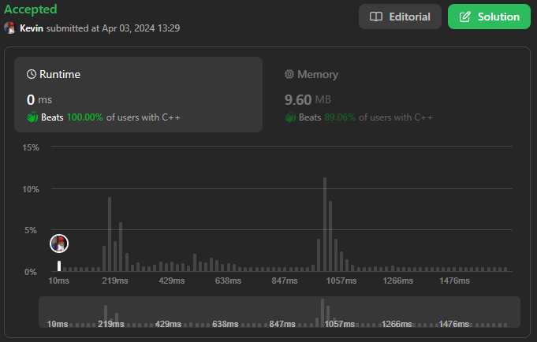
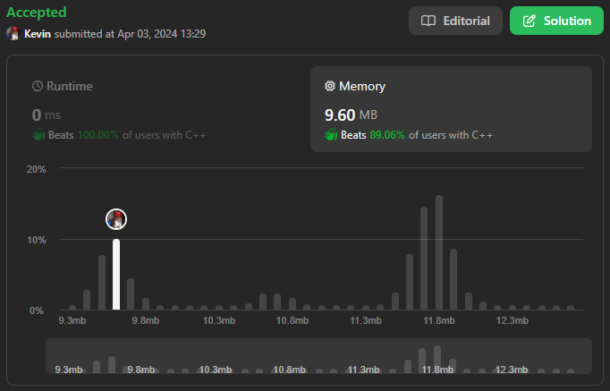

# 79. Word Search

## Énoncé

Étant donné une grille de caractères `m x n` appelée `board` et une chaîne de caractères `word`, renvoyez `true` si `word` existe dans la grille.

Le mot peut être construit à partir de lettres de cellules séquentiellement adjacentes, où les cellules adjacentes sont voisines horizontalement ou verticalement. La même cellule de lettre ne peut être utilisée plus d’une fois.

Pourriez-vous utiliser **l'élagage de recherche** (**search pruning**) pour rendre votre solution plus rapide avec un `board` plus grand ?

## Exemple

**Exemple 1:**


**Input:** board = [["A","B","C","E"],["S","F","C","S"],["A","D","E","E"]], word = "ABCCED"  
**Output:** true

**Exemple 2:**


**Input:** board = [["A","B","C","E"],["S","F","C","S"],["A","D","E","E"]], word = "SEE"  
**Output:** true

**Exemple 3:**


**Input:** board = [["A","B","C","E"],["S","F","C","S"],["A","D","E","E"]], word = "ABCB"  
**Output:** false

## Contraintes

`m == board.length`  
`n = board[i].length`  
`1 <= m, n <= 6`  
`1 <= word.length <= 15`  
`board` et `word` se compose uniquement de lettres anglaises minuscules et majuscules.

## Note personnelle

Ma première intuition été a été d'utiliser une recherche en profondeur (DFS) pour trouver le mot dans la grille. Cependant, cette méthode s'est progressivement transformée en backtracking lorsque j'ai réalisé que chaque cellule ne pouvait être utilisée qu'une fois par mot.

J'ai également utilisé une grille de booléens pour marquer les éléments déjà visités.

```cpp
// Vecteur d'indices pour déplacement dans les 4 directions
vector<pair<int, int>> indexHelper = {{1, 0}, {-1, 0}, {0, 1}, {0, -1}};

// Fonction récursive de backtracking pour rechercher le mot dans la grille
bool backtracking(vector<vector<char>>& board, string& word, int indexW, vector<vector<bool>> &seen, int y, int x) {
  // Si on a parcouru tout le mot, c'est une solution
  if (indexW == word.size()) {
    return true;
  }

  // Parcours des déplacements possibles
  for (const auto& iH : indexHelper) {
    int _y = y + iH.first;
    int _x = x + iH.second;

    // Vérification des limites de la grille et correspondance avec le prochain caractère du mot
    if (_y >= 0 && _y < board.size() && _x >= 0 && _x < board[0].size() && board[_y][_x] == word[indexW] && !seen[_y][_x]) {
      // Marquer la case comme visitée
      seen[_y][_x] = true;
      // Appel récursif pour explorer le prochain caractère
      if (backtracking(board, word, indexW + 1, seen, _y, _x)) {
        return true;
      }
      // Réinitialiser la case après l'exploration
      seen[_y][_x] = false;
    }
  }

  // Aucune solution trouvée à partir de cette position
  return false;
}

bool exist(vector<vector<char>>& board, string word) {
  // Initialisation d'une grille pour garder une trace des cases visitées
  vector<vector<bool>> seen(board.size(), vector<bool>(board[0].size(), false));

  // Parcours de la grille
  for (int y = 0; y < board.size(); y++) {
    for (int x = 0; x < board[0].size(); x++) {
      // Si la lettre actuelle correspond à la première lettre du mot
      if (board[y][x] == word[0]) {
        // Marquer la case comme visitée
        seen[y][x] = true;
        // Appel à la fonction de backtracking pour rechercher le reste du mot
        if (backtracking(board, word, 1, seen, y, x)) {
          return true;
        }
        // Réinitialiser la case après l'exploration
        seen[y][x] = false;
      }
    }
  }

  // Le mot n'a pas été trouvé dans la grille
  return false;
}
```

La complexité temporelle de cette approche est de `O(n * m * 4^l)`, où `n` est le nombre de lignes dans la grille, `m` le nombre de colonnes, `l` la longueur du mot. La complexité spatiale est de `O(n * m + l)`.

Cette approche est optimisable. On peut réduire l'arbre de recherche en comptant la fréquence d'apparition du premier et dernier caractère de `word`. Si la fréquence du premier caractère est supérieure à celle du dernier, on inverse `word`.

```cpp
// À mettre au début de la fonction exist
int countFirstChar = 0;
int countLastChar = 0;

for(int y = 0; y < board.size(); y++){
  for(int x = 0; x < board[0].size(); x++){
    if(board[y][x] == word[0]){
      countFirstChar++;
    }
    else if(board[y][x] == word.back()){
      countLastChar++;
    }
  }
}

if(countFirstChar > countLastChar){
  reverse(word.begin(), word.end());
}

// Reste du code de la fonction exist
```

La complexité temporelle et spatiale reste la même que l'approche précédente.

On peut encore optimiser cette approche au niveau de la complexité spatiale. Au lieu d'utiliser une grille pour garder une trace des éléments visités, on peut modifier directement `board`, ce qui en plus permet d'enlever quelques conditions dans le `if` de la fonction `backtracking`.

Cette approche présente la même complexité temporelle que les autres mais a une complexité spatiale de `O(l)`.

L'implémentation de toutes ces optimisations est disponible [ici](main.cpp).



