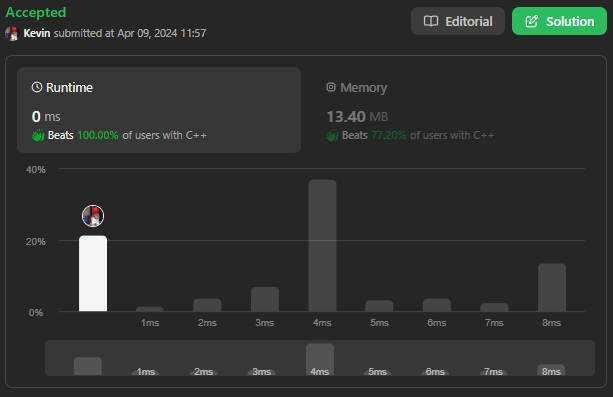
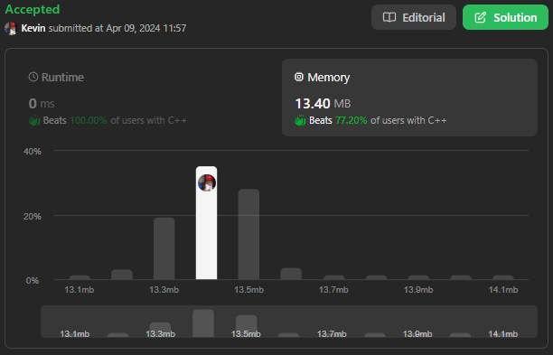

# 80. Remove Duplicates from Sorted Array II

## Énoncé

Étant donné un tableau d'entiers `nums` triés par **ordre croissant**, supprimez certains doublons sur place de telle sorte que chaque élément unique apparaisse **au plus deux fois**. L'**ordre relatif** des éléments doit rester le **même**.

Vous devez faire en sorte que le résultat soit placé dans la **première partie** du tableau `nums`. Plus formellement, les `k` premiers éléments de `nums` devraient contenir le résultat final. Peu importe ce que vous laissez au-delà des premiers `k` éléments.

Renvoie `k` après avoir placé le résultat final dans les `k` premiers emplacements de `nums`.

Vous devez le faire en **modifiant le tableau d'entrée** sur place avec une complexité spatiale de `O(1)`.

**Juge:**

Le juge testera votre solution avec le code suivant:

```
int[] nums = [...]; // Input array
int[] expectedNums = [...]; // The expected answer with correct length

int k = removeDuplicates(nums); // Calls your implementation

assert k == expectedNums.length;
for (int i = 0; i < k; i++) {
    assert nums[i] == expectedNums[i];
}
```

Si toutes les assertions sont réussies, alors votre solution sera **acceptée**.

## Exemple

**Exemple 1:**  
**Input:** nums = [1,1,1,2,2,3]  
**Output:** 5, nums = [1,1,2,2,3,_]

**Exemple 2:**  
**Input:** nums = [0,0,1,1,1,1,2,3,3]  
**Output:** 7, nums = [0,0,1,1,2,3,3,_,_]

## Contraintes

`1 <= nums.length <= 3 * 10^4`  
`-10^4 <= nums[i] <= 10^4`  
`nums` est trié par ordre croissant.

## Note personnelle

J'aborde le problème en utilisant la technique des **Deux Pointeurs**:

- Le premier pointeur, `i`, est utilisé pour parcourir le tableau d'origine.
- Le second pointeur, `size`, est utilisé pour ajouter des éléments au nouveau tableau.

J'utilise également deux variables supplémentaires:

- `current`, qui garde la trace de l'élément auquel nous comptons sa fréquence, initialisé avec le premier élément de `nums`.
- `count`, la fréquence de l'élément `current`, initialisée à `1`.

Je parcours `nums` à partir du deuxième élément. À chaque itération, je vérifie si `count` a la valeur `1` ou si `nums[i]` est différent de `current`.

Si c'est le cas, je procède au déplacement de l'élément dans le nouveau tableau et j'incrémente `size`. Si `nums[i] == current` j'incrémente `count`, sinon j'assigne `nums[i]` à `current` et je réinitialise `count`.

Cette approche présente une complexité temporelle de `O(n)`, où `n` est la taille de `nums` , et une complexité spatiale de `O(1)`.



