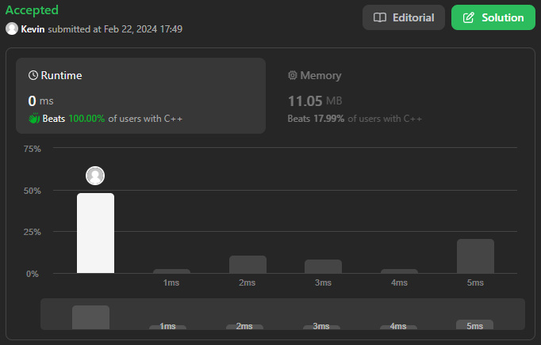

# 88. Merge Sorted Array

## Énoncé

Vous recevez deux tableaux d'entiers `nums1` et `nums2`, triés par **ordre croissant**, et deux entiers `m` et `n`, représentant respectivement le nombre d'éléments dans `nums1` et `nums2`.

**Fusionner** `nums1` et `nums2` en un seul tableau trié par **ordre croissant**.

Le tableau trié final ne doit pas être renvoyé par la fonction, mais plutôt être stocké dans le tableau `nums1`. Pour s'adapter à cela, `nums1` a une longueur de `m + n`, où les premiers éléments `m` désignent les éléments qui doivent être fusionnés, et les derniers `n` éléments sont définis sur `0` et doivent être ignorés. `nums2` a une longueur de `n`.

Pouvez-vous proposer un algorithme qui a une complexité temporelle de `O(m + n)` ?

## Exemple

**Exemple 1:**  
**Input:** nums1 = [1,2,3,0,0,0], m = 3, nums2 = [2,5,6], n = 3  
**Output:** [1,2,2,3,5,6]  
**Explication:** Les tableaux que nous fusionnons sont [1,2,3] et [2,5,6].  
Le résultat de la fusion est [<ins>1</ins>,<ins>2</ins>,2,<ins>3</ins>,5,6] avec les éléments soulignés provenant de nums1.

**Exemple 2:**  
**Input:** nums1 = [1], m = 1, nums2 = [], n = 0  
**Output:** [1]  
**Explication:** Les tableaux que nous fusionnons sont [1] et [].  
Le résultat de la fusion est [1].

**Exemple 3:**  
**Input:** nums1 = [0], m = 0, nums2 = [1], n = 1  
**Output:** [1]  
**Explication:** Les tableaux que nous fusionnons sont [] et [1].  
Le résultat de la fusion est [1].  
Notez que comme m = 0, il n’y a aucun élément dans nums1. Le 0 n'est là que pour garantir que le résultat de la fusion peut tenir dans nums1.

## Contraintes

`nums1.length == m + n`  
`nums2.length == n`  
`0 <= m, n <= 200`  
`1 <= m + n <= 200`  
`-10^9 <= nums1[i], nums2[j] <= 10^9`

## Note personnelle

Il existait plusieurs approches pour résoudre ce problème.  
La méthode la plus simple consistait à parcourir le tableau `nums1` de `m` à `n + m` et à assigner les valeurs de `nums2[0]` jusqu'à `nums2[m - 1]`.  
Ensuite, ce tableau était trié à l'aide de la fonction de tri. Cependant, cette approche n'était pas optimale en termes de complexité, avec une complexité de `O((m + n) * log(m + n))`.

Une autre approche à laquelle j'ai pensé, étant donné que les tableaux étaient triés, consistait à parcourir le tableau `nums2` et à utiliser une recherche dichotomique pour trouver où placer l'élément dans `nums1`, suivi d'un décalage des éléments.  
Mais même cette approche ne réduisait pas la complexité à `O(m + n)`.

La dernière approche, qui est donc ma version finale pour cet exercice, ne parcourt qu'une seule fois la liste `nums1` et a donc une complexité de `O(m + n)`.  
Elle utilise deux indices représentant l'indice du tableau `nums2` et l'indice d'un tableau temporaire.  
Ce tableau temporaire stocke les éléments de `nums1` qui ne sont pas bien placés.  
À chaque itération, je prends la plus petite valeur se trouvant dans le tableau temporaire ou `nums2`, puis je vérifie si la valeur actuelle de `nums1` est supérieure.  
Si c'est le cas, j'ajoute la valeur de `nums1[i]` à la fin de mon tableau temporaire et je change sa valeur. Grâce à l'utilisation des deux indices pour le tableau temporaire et `nums2`, je peux récupérer les valeurs les plus petites de ces deux tableaux avec un temps constant.

J'ai également tenté de réduire la complexité temporelle sans utiliser de tableau temporaire, mais je n'ai pas réussi.

