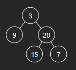
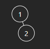

# 104. Maximum Depth of Binary Tree

## Énoncé

Étant donné la `root` d'un arbre binaire, renvoie sa profondeur maximale.

La **profondeur maximale** d'un arbre binaire est le nombre de noeuds le long du chemin le plus long depuis le noeud racine jusqu'au noeud feuille le plus éloigné.

## Exemple

**Exemple 1:**



**Input:** root = [3,9,20,null,null,15,7]  
**Output:** 3

**Exemple 2:**



**Input:** root = [1,null,2]  
**Output:** 2

## Contraintes

Le nombre de noeuds dans l'arborescence est compris entre `[0, 10^4]`.  
`-100 <= Node.val <= 100`

## Note personnelle

Dans ce problème, nous abordons un cas fondamental d'exploration d'arbre, pour lequel je propose quatre solutions:

### Première approche **DFS Récursif**:

Cette approche exploite la pile d'appel de fonction pour explorer l'arbre en profondeur. Elle est implémentée comme suit:

```cpp
int maxDepth(TreeNode* root) {
  // Si le noeud est nul, cela signifie que le sous-arbre est vide,
  // donc sa profondeur est 0.
  if (root == nullptr) {
    return 0;
  }

  // Sinon, on calcule récursivement la profondeur maximale
  // du sous-arbre gauche et du sous-arbre droit.
  // La profondeur maximale de l'arbre est la plus grande profondeur entre
  // le sous-arbre gauche et le sous-arbre droit, plus 1 pour le noeud actuel.
  return max(maxDepth(root->left), maxDepth(root->right)) + 1;
}
```

Bien que cette version soit concise, elle peut sembler complexe pour ceux qui ne sont pas familiers avec les fonctions récursives.

Sa complexité temporelle est `O(n)`, où `n` est le nombre d'éléments de l'arbre, la complexité spatiale est `O(h)` ou `h` est la hauteur de l'arbre.

### Seconde approche **DFS Itératif**:

Cette méthode utilise une pile pour itérer à travers l'arbre.

```cpp
int maxDepth(TreeNode* root) {
  // Si le noeud racine est nul, cela signifie que l'arbre est vide,
  // donc sa profondeur est 0.
  if(!root){
    return 0;
  }

  int depth = 0; // Initialiser la profondeur maximale à 0

  // Déclarer une pile contenant des paires de noeuds et de profondeurs
  stack<pair<TreeNode*, int>> s;
  // Ajouter la paire (noeud racine, profondeur 1) à la pile
  s.push(make_pair(root, 1));

  // Parcours de l'arbre jusqu'à ce que la pile soit vide
  while(!s.empty()){
    // Obtenir la paire de noeud et de profondeur en haut de la pile
    pair<TreeNode*, int> current = s.top();
    s.pop();

    // Mettre à jour la profondeur maximale
    depth = max(depth, current.second);

    // Si le noeud a un enfant gauche ou droite, ajouter à la pile une paire
    // contenant cet enfant et la profondeur du noeud actuel plus un.
    if(current.first->left){
      s.push(make_pair(current.first->left, current.second + 1));
    }
    if(current.first->right){
      s.push(make_pair(current.first->right, current.second + 1));
    }
  }

  // Retourner la profondeur maximale de l'arbre
  return depth;
}
```

Cette approche itérative est moins concise mais plus accessible pour ceux qui ne sont pas à l'aise avec la récursivité. Elle présente la même complexité temporelle et spatiale que l'approche récursive.

### Troisième approche **BFS Itérative**:

Ici, j'utilise une file d'attente pour parcourir l'arbre par niveau.

```cpp
int maxDepth(TreeNode* root) {
  // Déclarer une file d'attente contenant des pointeurs vers les noeuds
  queue<TreeNode*> q;

  // Si le noeud racine n'est pas nul, ajouter le noeud racine à la file d'attente
  if(root){
    q.push(root);
  }

  int currentDepth = 0; // Initialiser la profondeur actuelle à 0

  // Parcours de l'arbre jusqu'à ce que la file d'attente soit vide
  while(!q.empty()){
    // Obtenir la taille actuelle de la file d'attente
    size_t currentSize = q.size();

    for(int i = 0; i < currentSize; i++){
      // Obtenir le premier noeud de la file d'attente
      TreeNode* current = q.front();
      q.pop();

      // Si le noeud a un enfant gauche ou droit, ajouter cet enfant à la file d'attente
      if(current->left){
        q.push(current->left);
      }
      if(current->right){
        q.push(current->right);
      }
    }
    // Incrémenter la profondeur actuelle après avoir traité tous les noeuds du niveau actuel
    currentDepth++;
  }

  // Retourner la profondeur maximale de l'arbre
  return currentDepth;
}
```

Cette approche est probablement la plus simple à comprendre. Elle a une complexité temporelle de `O(n)` et spatiale de `O(w)`, où `w` est la largeur maximale de l'arbre.

### Quatrième approche **BFS Récursif**:

```cpp
// La fonction bfs effectue un parcours en largeur récursif à partir de la file d'attente donnée
// et retourne la profondeur maximale atteinte.
int bfs(vector<TreeNode*> &q){
  // Si la file d'attente est vide, cela signifie que le sous-arbre est vide,
  // donc sa profondeur est 0.
  if(q.size() == 0){
    return 0;
  }

   // Vecteur pour stocker les noeuds du niveau suivant
  vector<TreeNode*> next;

  // Parcourir tous les noeuds de la file d'attente actuelle
  for(const auto &element : q){
    // Si le noeud a un enfant droit, l'ajouter au niveau suivant
    if(element->right){
      next.push_back(element->right);
    }
    // Si le noeud a un enfant gauche, l'ajouter au niveau suivant
    if(element->left){
      next.push_back(element->left);
    }
  }

  // Appeler récursivement bfs avec les noeuds du niveau suivant et retourner la profondeur maximale,
  // en incrémentant de 1 pour chaque niveau parcouru.
  return bfs(next) + 1;
}

int maxDepth(TreeNode* root) {
  // Si le noeud racine est nul, cela signifie que l'arbre est vide,
  // donc sa profondeur est 0.
  if(!root){
    return 0;
  }

  // Initialiser la file d'attente avec le noeud racine
  vector<TreeNode*> q = {root};
  // Appeler la fonction bfs pour obtenir la profondeur maximale
  return bfs(q);
}
```

Il s'agit d'une première tentative de parcours en largeur récursif, elle ne présente pas d'avantages évidents et est moins optimale.

Elle présente une complexité temporelle et spatiale de `O(n)`.


