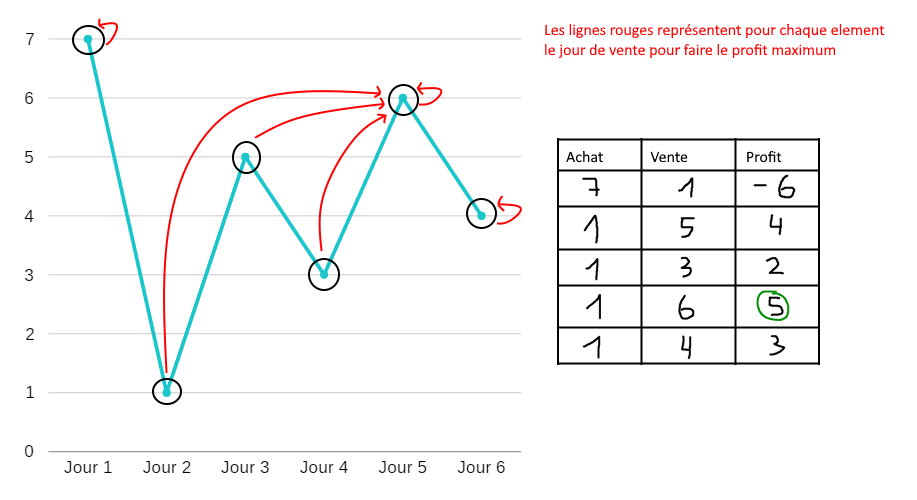
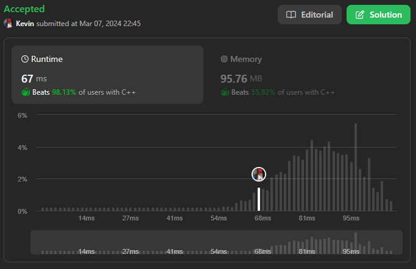
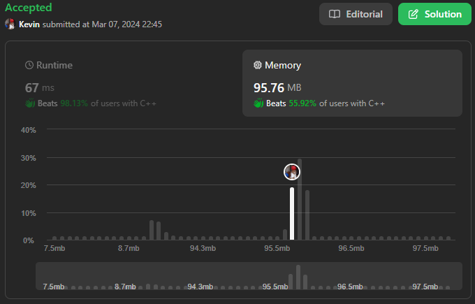

# 121. Best Time to Buy and Sell Stock

## Énoncé

Vous recevez un tableau `prices` où `prices[i]` est le prix d'une action donnée le `ième` jour.

Vous souhaitez maximiser votre profit en choisissant **un seul jour** pour acheter une action et en choisissant un **jour différent dans le futur** pour vendre cette action.

Renvoyez le profit maximum que vous pouvez réaliser grâce à cette transaction. Si vous ne parvenez à réaliser aucun profit, renvoyez `0`.

## Exemple

**Exemple 1:**  
**Input:** prices = [7,1,5,3,6,4]  
**Output:** 5  
**Explication:** Achetez le jour 2 (prix = 1) et vendez le jour 5 (prix = 6), profit = 6-1 = 5.
Notez qu’acheter le jour 2 et vendre le jour 1 ne sont pas autorisés car vous devez acheter avant de vendre.

**Exemple 2:**  
**Input:** prices = [7,6,4,3,1]  
**Output:** 0  
**Explication:** Dans ce cas, aucune transaction n'est effectuée et le profit maximum = 0.

## Contraintes

`1 <= prices.length <= 10^5`  
`0 <= prices[i] <= 10^4`

## Note personnelle

Dans ma méthode, à chaque itération, je conserve une trace de la plus petite valeur actuellement trouvée et calcule le profit maximal avec cette valeur minimale, qui représente l'achat d'une action.

Le schéma ci-dessous illustre ce principe avec un graphique et un tableau pour interpréter les résultats:

Cette méthode est de type gloutonne car elle prend la meilleure décision locale, mais pour ce problème spécifique, elle permet d'obtenir une solution optimale globale.

Elle a une complexité temporelle de `O(n)` et une complexité spatiale de `O(1)`.

