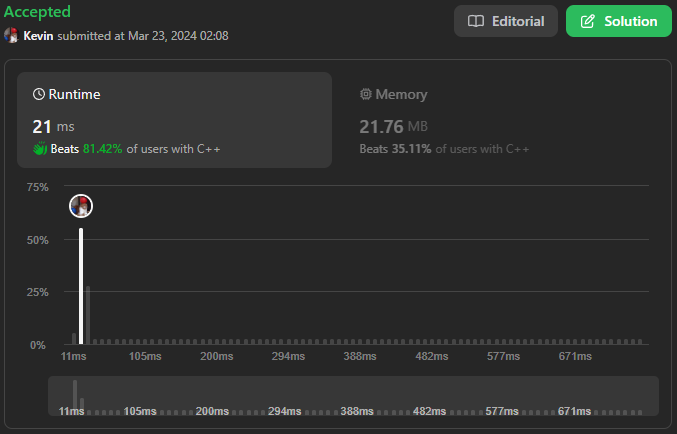

# 143. Reorder List

## Énoncé

Vous recevez la tête d'une liste chaînée simple. La liste peut être représentée comme suit:

`L0 → L1 → … → Ln-1 → Ln`

Réorganisez la liste pour qu'elle soit sous la forme suivante:

`L0 → Ln → L1 → Ln-1 → L2 → Ln-2 → …`

Vous ne pouvez pas modifier les valeurs dans les noeuds de la liste. Seuls les noeuds eux-mêmes peuvent être modifiés.

## Exemple

**Exemple 1:**  


**Input:** head = [1,2,3,4]  
**Output:** [1,4,2,3]

**Exemple 2:**  


**Input:** head = [1,2,3,4,5]  
**Output:** [1,5,2,4,3]

## Contraintes

Le nombre de noeuds dans la liste est compris entre `[1, 5 * 10^4].`  
`1 <= Node.val <= 1000`

## Note personnelle

Pour ma première approche, je propose de diviser la liste en deux parties, en mettant chaque élément de la seconde moitié dans une pile. Ensuite, je parcours la première moitié de la liste en alternant entre l'élément courant et celui au sommet de la pile.

Pour ce faire, j'utilise la technique des pointeurs lent et rapide pour trouver le milieu de la liste. Une fois le milieu trouvé, je continue à parcourir la liste en mettant les éléments dans la pile.

Ensuite, j'itére une dernière fois sur le début de la pile en réassignant correctement les pointeurs.

Cette approche a une complexité temporelle et spatiale de `O(n)`.

J'ai également mis en place une approche récursive avec la même idée, mais une implémentation différente:

```cpp
// Déclaration d'un pointeur global vers le début de la liste
ListNode* h;
// Initialisation du compteur pour le nombre total de noeuds dans la liste
int count = 0;
// Initialisation du compteur pour le nombre actuel de noeuds déplacés
int currentCount = 0;
// Variable booléenne pour indiquer la fin de la réorganisation de la liste
bool end = false;

// Fonction récursive pour réorganiser la liste
void r(ListNode * head){
  // Vérifie si le noeud actuel est nul
  if(!head){
    // Si c'est le cas, sort de la fonction récursive
    return;
  }
  // Incrémente le compteur de noeuds
  count++;

  // Appel récursif pour avancer dans la liste jusqu'au dernier noeud
  r(head->next);
  // Vérifie si la moitié des noeuds ont déjà été traités
  if(count / 2 > currentCount){
    // Incrémente le compteur de noeuds déplacés
    currentCount++;
    // Sauvegarde le noeud suivant dans la liste initiale
    ListNode * temp = h->next;
    // Relie le noeud actuel à la liste réorganisée
    h->next = head;
    // Déplace le pointeur global vers le noeud suivant dans la liste initiale
    h = temp;
    // Relie le noeud actuel à la suite de la liste réorganisée
    head->next = h;
  }
  // Si la fin de la réorganisation n'a pas encore été marquée
  else if(!end){
    // Marque la fin de la réorganisation
    end = true;
    // Définit la fin de la liste réorganisée à nullptr
    h->next = nullptr;
  }
}
void reorderList(ListNode* head) {
  // Initialise le pointeur global au début de la liste
  h = head;
  // Appel de la fonction récursive pour réorganiser la liste
  r(head);
}
```

La complexité temporelle et spatiale de cette approche est également de `O(n)` en raison de sa nature récursive.



