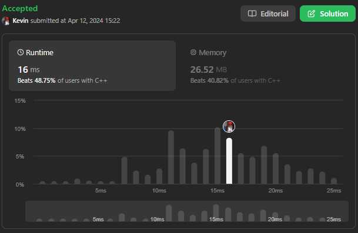
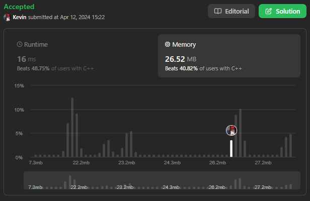

# 169. Majority Element

## Énoncé

Étant donné un tableau `nums` de taille `n`, renvoie l'élément majoritaire.

L'élément majoritaire est l'élément qui apparaît plus de `⌊n / 2⌋` fois. Vous pouvez supposer que l'élément majoritaire existe toujours dans le tableau.

Pourriez-vous résoudre le problème avec une complexité temporelle `O(n)` et une complexité spatiale `O(1)` ?

## Exemple

**Exemple 1:**  
**Input:** nums = [3,2,3]  
**Output:** 3

**Exemple 2:**  
**Input:** nums = [2,2,1,1,1,2,2]  
**Output:** 2

## Contraintes

`n == nums.length`  
`1 <= n <= 5 * 10^4`  
`-10^9 <= nums[i] <= 10^9`

## Note personnelle

Pour aborder ce problème, ma première réflexion a été d'utiliser une HashMap pour comptabiliser le nombre d'occurrences des éléments, tout en gardant une trace de l'élément ayant le plus grand nombre d'occurrences.

```cpp
int majorityElement(vector<int>& nums) {
  // Déclaration d'une unordered_map pour stocker les occurrences de chaque élément
  unordered_map<int, int> mp;

  // Variables pour suivre l'élément majoritaire et son nombre d'occurrences maximal
  int maxCount = 0;
  int ans = 0;

  // Parcours du vecteur 'nums'
  for(int n : nums){
    // Incrémentation du nombre d'occurrences de l'élément actuel dans la map
    mp[n]++;
    // Vérification si le nombre d'occurrences de l'élément actuel dépasse le maximum enregistré
    if(mp[n] > maxCount){
      // Mise à jour de l'élément majoritaire et de son nombre d'occurrences maximal
      maxCount = mp[n];
      ans = n;
    }
  }

  // Retour de l'élément majoritaire
  return ans;
}
```

Cette méthode présente une complexité temporelle et spatiale de `O(n)`, où `n` est le nombre d'éléments dans `nums`.

Une autre approche consiste à trier le tableau et à tirer parti du fait que l'élément majoritaire a un nombre minimal d'occurrences de `n / 2`.

```cpp
int majorityElement(vector<int>& nums) {
  sort(nums.begin(), nums.end());
  return nums[nums.size() / 2];
}
```

Cette approche présente une compléxité temporelle de `O(n log n)` et une complexité spatiale de `O(n log n)`.

La dernière approche consiste également à exploiter le nombre d'occurrences de l'élément majoritaire. L'idée est qu'un nombre est un candidat potentiel. Si on le rencontre à nouveau, on ajoute `1` à son nombre d'occurrences, sinon `-1`. Si son nombre d'occurrences devient `0`, alors on change de candidat. alors on change de candidat. Cet algorithme fonctionne seulement dans le cas où l'élément majoritaire est présent au moins `n / 2` fois dans le tableau et est connu sous le nom d' **Algorithme de vote majoritaire Boyer-Moore**.

Cette approche présente une complexité temporelle de `O(n)` et une complexité spatiale de `O(1)`.



