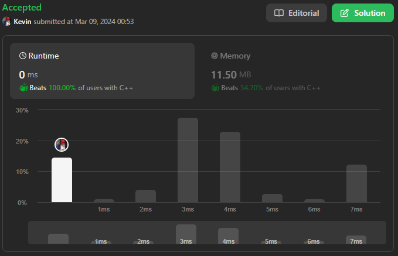

# 206. Reverse Linked List

## Énoncé

Étant donné la `head` d’une liste chaînée, inversez la liste et renvoyez la liste inversée.

Une liste chaînée peut être inversée de manière itérative ou récursive. Pourriez-vous mettre en oeuvre les deux ?

## Exemple

**Exemple 1:**


**Input:** head = [1,2,3,4,5]  
**Output:** [5,4,3,2,1]

**Exemple 2:**


**Input:** head = [1,2]  
**Output:** [2,1]

**Exemple 3:**  
**Input:** head = []  
**Output:** []

## Contraintes

Le nombre de noeuds dans la liste est compris entre `[0, 5000]`.  
`-5000 <= Node.val <= 5000`

## Note personnelle

J'ai mis en place une première approche sous forme d'une version itérative que vous pouvez trouver [ici](main.cpp).

Le concept de cette approche consiste à initialiser deux pointeurs: `current`,représentant l'élément actuellement traité, et `n`, représentant l'élément précédant. Au début, `current` pointe vers `head` et `n` est initialisé à `nullptr`.

Nous itérons sur la liste tant que `current` n'est pas nul. À chaque itération, les opérations suivantes sont effectuées:

- Sauvegarde temporaire du pointeur suivant de `current` dans `temp`
- Inversion du lien vers le prochain élément en faisant pointer l'élément `current` vers `n`
- Mise à jour de `n` pour qu'il pointe vers l'élément précédent pour la prochaine itération, c'est-à-dire `current`
- Mise à jour de `current` pour qu'il pointe vers l'élément suivant à traiter, qui est `temp`

La complexité temporelle de cette approche est de `O(n)`, tandis que la complexité spatiale est de `O(1)`.

L'approche récursive repose sur le même principe :

```cpp
// Fonction récursive pour inverser une liste chaînée
ListNode* reverseRec(ListNode *current, ListNode *prev = nullptr) {
    // Si le noeud actuel est nul, nous avons atteint la fin de la liste,
    // donc nous retournons le noeud précédent qui est maintenant la tête de la liste inversée
    if (!current) {
        return prev;
    }

    ListNode *next = current->next; // Stockage temporaire du prochain noeud
    current->next = prev; // Modification du pointeur suivant du noeud actuel pour pointer vers le noeud précédent

    // Appel récursif avec le noeud suivant comme noeud actuel et le noeud actuel comme noeud précédent
    return reverseRec(next, current);
}

ListNode* reverseList(ListNode* head) {
    // Appel de la fonction récursive avec la tête de la liste et un pointeur nul comme noeud précédent
    return reverseRec(head);
}
```

Cette approche récursive a une complexité temporelle de `O(n)` et une complexité spatiale de `O(n)` également, en raison de sa nature récursive.



