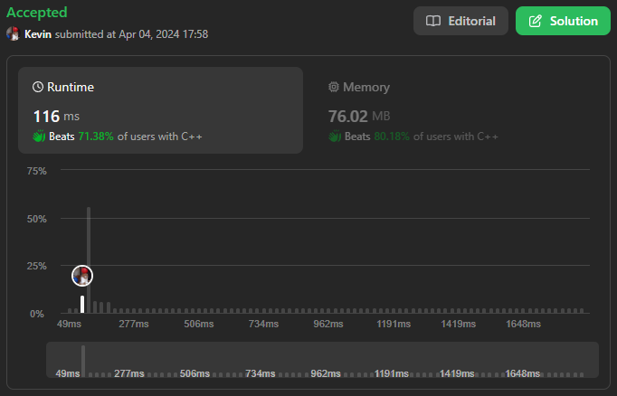

# 219. Contains Duplicate II

## Énoncé

Étant donné un tableau d'entiers `nums` et un entier `k`, renvoie `true` s'il y a **deux indices distincts** `i` et `j` dans le tableau tels que `nums[i] == nums[j ]` et `abs(i - j) <= k`.

## Exemple

**Exemple 1:**  
**Input:** nums = [1,2,3,1], k = 3  
**Output:** true

**Exemple 2:**  
**Input:** nums = [1,0,1,1], k = 1  
**Output:** true

**Exemple 3:**  
**Input:** nums = [1,2,3,1,2,3], k = 2  
**Output:** false

## Contraintes

`1 <= nums.length <= 10^5`  
`-10^9 <= nums[i] <= 10^9`  
`0 <= k <= 10^5`

## Note personnelle

Dans ma première approche, j'ai employé une structure de données HashMap où les clés sont des nombres et les valeurs représentent les derniers indices où ces nombres ont été rencontrés.

Le processus consiste simplement à parcourir `nums`. Pour chaque élément, on vérifie s'il est présent dans la HashMap. Si tel est le cas et que la différence entre l'indice actuel et l'indice précédent de cet élément est inférieure ou égale à `k`, alors on retourne `true`.

Si la boucle se termine sans avoir retourné `true`, on renvoie `false`.

```cpp
bool containsNearbyDuplicate(vector<int>& nums, int k) {
  // Déclarer un dictionnaire non ordonné pour stocker les indices des éléments
  unordered_map<int, int> mp;

  for(int i = 0; i < nums.size(); i++){
    // Si l'élément est déjà présent dans le dictionnaire
    if(mp.find(nums[i]) != mp.end()){
      // Vérifier si la différence entre l'index actuel et l'index précédent de cet élément est inférieure ou égale à k
      if(i - mp[nums[i]] <= k){
        // Si oui, il y a un doublon dans la fenêtre k, retourner true
        return true;
      }
    }
    // Mettre à jour ou ajouter l'index de l'élément dans le dictionnaire
    mp[nums[i]] = i;
  }

  // Aucun doublon trouvé dans la fenêtre k, retourner false
  return false;
}
```

Cette approche présente une complexité temporelle et spatiale de `O(n)`, où `n` est le nombre d'éléments dans `nums`.

Une amélioration de cet algorithme consiste à utiliser le principe de la fenêtre glissante (Sliding Window) avec un ensemble.

On parcourt les `k` premiers éléments (ou tous les éléments de `nums`, si `nums.size() <= k`). Pour chaque élément, on vérifie s'il est présent dans l'ensemble. Si oui, on retourne `true`, sinon on l'ajoute à l'ensemble.

Ensuite, on itère à partir de l'indice `k + 1`. À chaque itération, on supprime l'élément qui dépasse de la fenêtre (`nums[i - k - 1]`). On vérifie si l'élément actuel est dans l'ensemble. Si oui, on retourne `true`, sinon on l'ajoute à l'ensemble.

Si la boucle se termine sans avoir retourné `true`, on retourne `false`.

Cette approche présente une complexité temporelle de `O(n)` et une complexité spatiale de `O(min(n, k))`.



