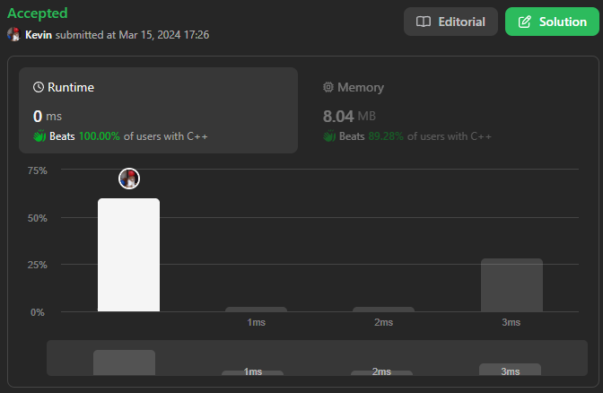
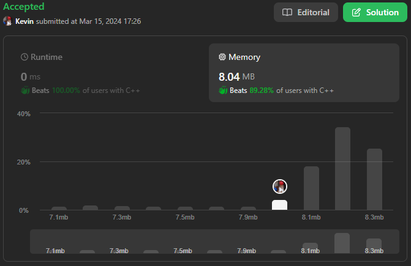

# 225. Implement Stack using Queues

## Énoncé

Mettre en oeuvre une pile de type dernier entré, premier sorti (LIFO) en n'utilisant que deux files. La pile mise en oeuvre doit prendre en charge toutes les fonctions d'une pile normale (`push`, `top`, `pop`, and `empty`).

Implémentez la classe `MyStack` :

- `void push(int x)` Pousse l'élément x vers le haut de la pile.
- `int pop()` Supprime l'élément en haut de la pile et le renvoie.
- `int top()` Renvoie l'élément en haut de la pile.
- `boolean empty()` Renvoie `true` si la pile est vide, `false` sinon.

Notes:

- Vous devez utiliser uniquement les opérations standard d'une file d'attente, ce qui signifie que seules les opérations `push to back`, `peek/pop from front`, `size` et `is empty` sont valides.
- Selon votre langue, la file d'attente peut ne pas être prise en charge de manière native. Vous pouvez simuler une file d'attente à l'aide d'une liste ou d'un deque (file d'attente à double extrémité) à condition d'utiliser uniquement les opérations standard d'une file d'attente.

Pouvez-vous implémenter la pile en utilisant une seule file d’attente ?

## Exemple

**Exemple 1:**  
**Input:**  
["MyStack", "push", "push", "top", "pop", "empty"]  
[[], [1], [2], [], [], []]  
**Output:**  
[null, null, null, 2, 2, false]  
**Explication:**  
MyStack myStack = new MyStack();  
myStack.push(1);  
myStack.push(2);  
myStack.top(); // return 2  
myStack.pop(); // return 2  
myStack.empty(); // return False

## Contraintes

`1 <= x <= 9`  
Au plus `100` appels seront effectués vers `push`, `pop`, `top`, et `empty`.  
Tous les appels à `pop` et `top` sont valides.

## Note personnelle

Il y a 2 approches possible a ce probleme au vue des contraintes imposé, selon l'approche choisie, la compléxité temporelle de `push` ou `pop` sera de `O(n)` tandis que pour les autres methodes elle sera de `O(1)`.

Voici la premiere implémentation, ou la compléxité temporelle de `pop` est de `O(n)`:

```cpp
class MyStack {
public:
  // Déclaration de la file pour stocker les éléments du stack
  queue<int> q;
  // Variable pour stocker le dernier élément ajouté
  int t;

  MyStack() {}

  void push(int x) {
    // Met à jour la variable t avec le nouvel élément
    t = x;
    // Ajoute l'élément à la file
    q.push(x);
  }

  int pop() {
    // Vérifie si la file contient un seul élément
    if (q.size() == 1) {
      // Récupère l'unique élément de la file
      int element = q.front();
      // Supprime l'élément de la file
      q.pop();
      // Retourne l'élément supprimé
      return element;
    }

    // Déplace les éléments pour avoir l'avant dernier élément en tête de file (qui sera le premier element du stack)
    for (int i = 0; i < q.size() - 2; i++) {
      q.push(q.front());
      q.pop();
    }

    // Met à jour t avec le nouvel élément en tête de file
    t = q.front();
    // Ajoute cet élément à la fin de la file
    q.push(q.front());
    // Supprime l'ancienne tête de file
    q.pop();

    // Récupère l'élément à supprimer (le dernier de la file)
    int element = q.front();
    // Supprime cet élément de la file
    q.pop();
    // Retourne l'élément supprimé
    return element;
  }

  // Retourne le dernier élément ajouté (stocké dans t)
  int top() { return t; }

  // Vérifie si la file est vide
  bool empty() { return q.empty(); }
};
```

Voici les différentes compléxité pour chacune des méthodes de la classe:

- **`push(int x)`**: Complexité temporelle et spatiale `O(1)`.
- **`pop()`**: Complexité temporelle `O(n)` et complexité spatiale `O(1)`.
- **`top()`**: Complexité temporelle et spatiale `O(1)`.
- **`empty()`**: Complexité temporelle et spatiale `O(1)`.

Pour la seconde implémentation trouvable [ici](main.cpp), voici les différentes compléxité pour chacune des méthodes:

- **`push(int x)`**: Complexité temporelle `O(n)` et complexité spatiale `O(1)`.
- **`pop()`**: Complexité temporelle `O(1)`.
- **`top()`**: Complexité temporelle et spatiale `O(1)`.
- **`empty()`**: Complexité temporelle et spatiale `O(1)`.

La complexité spatiale globale des deux implémentation est `O(n)`.



