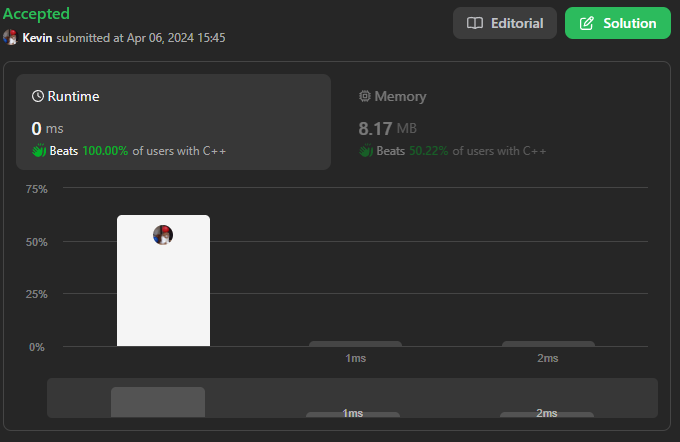
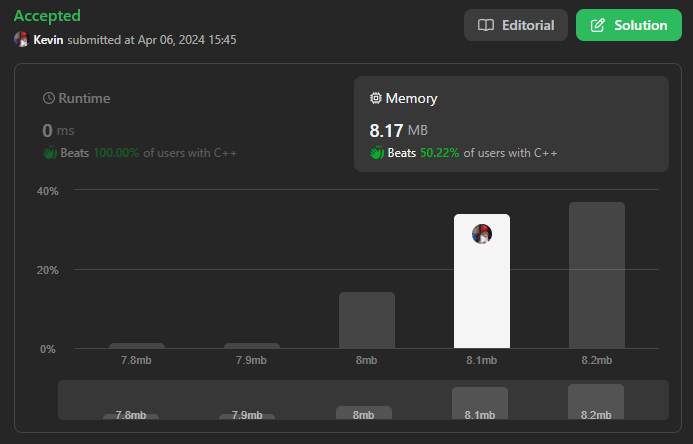

# 228. Summary Ranges

## Énoncé

Vous recevez un tableau d'entiers **triés uniques** `nums`.

Une **plage** `[a,b]` est l'ensemble de tous les entiers de `a` à `b` (inclus).

Renvoie la **plus petite liste triée** de plages qui **couvrent exactement tous les nombres du tableau**. Autrement dit, chaque élément de `nums` est couvert par exactement une des plages, et il n'y a pas d'entier `x` tel que `x` soit dans l'une des plages mais pas dans `nums`.

Chaque plage `[a,b]` dans la liste doit être affichée comme:

- `"a->b"` si `a != b`
- `"a"` si `a == b`

## Exemple

**Exemple 1:**  
**Input:** nums = [0,1,2,4,5,7]  
**Output:** ["0->2","4->5","7"]  
**Explication:** Les plages sont:  
[0,2] --> "0->2"  
[4,5] --> "4->5"  
[7,7] --> "7"

**Exemple 2:**  
**Input:** nums = [0,2,3,4,6,8,9]  
**Output:** ["0","2->4","6","8->9"]  
**Explication:** Les plages sont:  
[0,0] --> "0"  
[2,4] --> "2->4"  
[6,6] --> "6"  
[8,9] --> "8->9"

## Contraintes

`0 <= nums.length <= 20`  
`-2^31 <= nums[i] <= 2^31 - 1`  
Toutes les valeurs de `nums` sont **uniques**.  
`nums` est trié par ordre croissant.

## Note personnelle

Pour résoudre ce problème, j'adopte une méthode **Two Pointer**, `left` et `right`, qui délimitent une plage donnée.

À chaque itération, je fixe `left` à la même valeur que `right`, puis je parcours `nums` tant que l'élément actuel (à l'index `right`) est égal à l'élément précédent plus un.

Une fois la plage identifiée, je construis la chaîne de caractères correspondante que j'insère dans le vecteur `ans`, qui représente le résultat renvoyé par la fonction.

Cette approche garantit une complexité temporelle et spatiale de `O(n)`.

