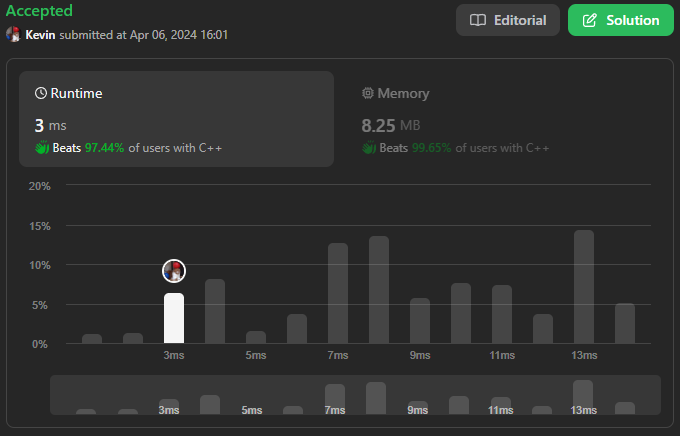

# 242. Valid Anagram

## Énoncé

Étant donné deux chaînes `s` et `t`, renvoie `true` si `t` est une anagramme de `s`, et `false` sinon.

Un **Anagramme** est un mot ou une expression formé en réorganisant les lettres d'un mot ou d'une expression différente, en utilisant généralement toutes les lettres d'origine exactement une fois.

**Suivi**: que se passe-t-il si les entrées contiennent des caractères Unicode ? Comment adapteriez-vous votre solution à un tel cas ?

## Exemple

**Exemple 1:**  
**Input:** s = "anagram", t = "nagaram"  
**Output:** true

**Exemple 2:**  
**Input:** s = "rat", t = "car"  
**Output:** false

## Contraintes

`1 <= s.length, t.length <= 5 * 10^4`  
`s` et `t` sont constitués de lettres anglaises minuscules.

## Note personnelle

Ma première stratégie tire parti de la nature des deux chaînes d'entrée, composées de lettres minuscules.

Pour ce faire, j'initialise un tableau de taille 26. Chaque élément de ce tableau est une paire d'entiers, où le premier élément représente le nombre d'occurrences dans la chaîne `s` et le second élément, le nombre d'occurrences dans la chaîne `t`.

Ensuite, je parcours les deux chaînes simultanément et j'incrémente le compteur approprié dans le tableau.

Après cela, je parcours le tableau et je vérifie pour chaque paire si leurs valeurs sont égales.

Cette approche présente une complexité temporelle de `O(n)`, où `n` est la taille de `s`, et une complexité spatiale de `O(1)`.

### Suivi

Pour répondre à la question posée dans l'énoncé : "Que se passe-t-il si les entrées contiennent des caractères Unicode ?", mon programme actuel pourrait rencontrer un dépassement de mémoire en raison du tableau de taille limitée.

J'ai implémenté deux approches différentes pour remédier à ce problème, chacune ayant ses avantages et inconvénients.

La première approche consisterait à remplacer le tableau par une HashMap, la logique restant la même.

```cpp
bool isAnagram(string &s, string &t) {
  // Vérifie si les deux chaînes ont des tailles différentes
  if(s.size() != t.size()) {
    // Si les tailles sont différentes, les chaînes ne peuvent pas être des anagrammes
    return false;
  }

  // Déclare une unordered_map pour compter les occurrences de chaque caractère dans les deux chaînes
  unordered_map<char, pair<int, int>> mp;

  // Parcourt les deux chaînes en même temps pour compter les occurrences de chaque caractère
  for(int i = 0; i < s.size(); i++){
    // Incrémente le compteur pour le caractère courant dans la première chaîne
    mp[s[i]].first++;
    // Incrémente le compteur pour le caractère courant dans la deuxième chaîne
    mp[t[i]].second++;
  }

  // Parcourt la unordered_map pour vérifier si les occurrences de chaque caractère sont égales dans les deux chaînes
  for(const auto &element : mp){
    if(element.second.first != element.second.second){
      return false;
    }
  }

  return true;
}
```

Cette approche présente une complexité temporelle de `O(n + m)` et une complexité spatiale de `O(m)`, où `m` est le nombre de caractères distincts des deux chaînes.

La deuxième approche consiste à trier les deux chaînes, car si elles sont des anagrammes, alors les deux chaînes triées seront identiques.

```cpp
bool isAnagram(string &s, string &t) {
  if(s.size() != t.size()){
    return false;
  }

  sort(s.begin(), s.end());
  sort(t.begin(), t.end());

  return s == t;
}
```

Cette approche présente une complexité temporelle de `O(n log n)` et une complexité spatiale de `O(1)`.

Finalement, l'approche avec la HashMap est plus efficace en termes de complexité temporelle, tandis que l'approche avec le tri permet d'utiliser moins de mémoire.



