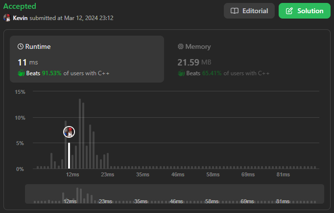

# 283. Move Zeroes

## Énoncé

Étant donné un tableau d'entiers `nums`, déplacez tous les `0`'s à la fin tout en conservant l'ordre relatif des éléments non nuls.

**Notez** que vous devez modifier le tableau d'origine sans faire de copie.

Pourriez-vous minimiser le nombre total d’opérations effectuées ?

## Exemple

**Exemple 1:**  
**Input:** nums = [0,1,0,3,12]  
**Output:** [1,3,12,0,0]

**Exemple 2:**  
**Input:** nums = [0]  
**Output:** [0]

## Contraintes

`1 <= nums.length <= 10^4`  
`-23^1 <= nums[i] <= 23^1 - 1`

## Note personnelle

Dans ma méthode, j'utilise deux indices, `i` et `j` initialement définis à `0`.

- `i` représente l'indice de la valeur en cours de traitement.
- `j` représente l'indice de la prochaine valeur différente de `0`.

Le concept est que s `nums[i]` est égal à `0`, nous itérons avec `j` jusqu'à ce que nous trouvions une valeur autre que `0`. Une fois trouvée, nous échangeons les deux valeurs.

Cette approche a une complexité temporelle de `O(n)` et une complexité spatiale de `O(1)`.

Concernant la mention **"Pouvez-vous minimiser le nombre total d'opérations effectuées ?"**, cela dépend de notre définition des opérations. Si nous considérons qu'une opération consiste en le déplacement d'un élément dans un tableau, mon approche est optimale. Cependant, si une opération prend en compte la lecture d'une valeur, alors mon approche n'est pas optimale dans le cas où des `0` sont dispersés dans le tableau avec seulement quelques éléments non nuls entre eux.

